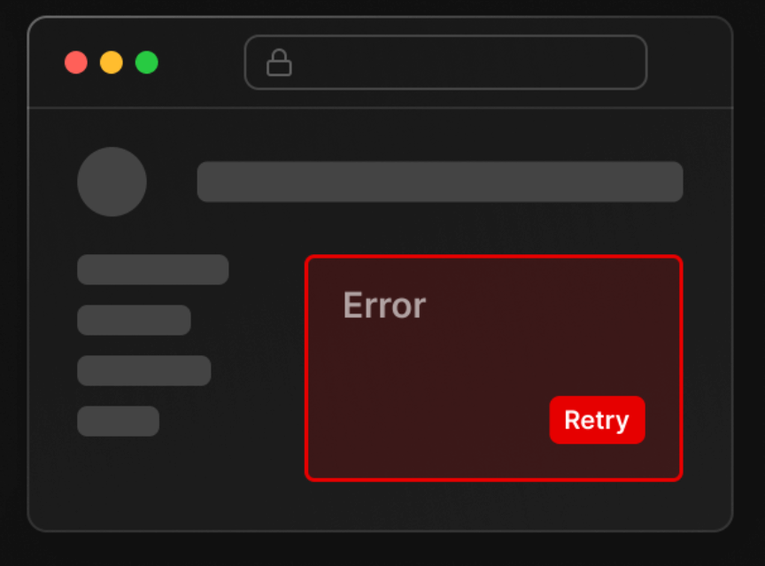

# TIL 240307 NEXTjs 메모
- 서버사이드 렌더링 특성상 페이지 이동시 새로고침이 됨, 그래서 로딩페이지가 필요함
- page.js 있는 폴더에 lodaing.js 파일 만들어 놓으면 알아서 해당 파일 UI불러와줌
- 실은 리액트에서의 <Suspense fallback={<h4>로딩중</h4>}> 이거랑 똑같은 역할을 해주는데,
- Next.js 에선 개발자 편하라고 loading.js 파일에 적으면 자동으로 <Suspense> 로 바꿔줘서 이게 가능한 것

- error.js 파일도 비슷하게 에러가 나면 해당 파일 코드를 불러옴
- error이름의 프롭스(파라미터)를 출력하면 에러 내용 나옴
- reset 프롭스를 () 붙여서 실행하면 해당페이지 다시 로딩
``
(error.js)

'use client'

export default function Error({error, reset}){
  return (
    

      <h4>오 이런 에러남</h4>
      <button onClick={()=>{ reset() }}>다시시도</button>
    

  )
}
``

- 옛날 웹사이트처럼 에러가 나면 페이지 전체가 다운되지 않고
- 에러난 page.js 부분만 error.js로 대체해서 보여줄 수 있기 때문에 
- 이거 쓰면 좀 더 이쁨, 중요한 페이지들에 쓰면 좋음
- 해당 폴더에 error.js가 없으면 상위로 이동해서 찾음, 가장 가까운걸 찾아서 보여줌

- 근데 layout.js에서 발생한 오류는 error.js가 모름, global-error.js파일 만들어서 써야함

- 404페이지는 not-found.js로 만들고 필요한 페이지에서 notFound()로 예외처리하기
- 얘도 주변에 해당 파일 없으면 계속 상위로 이동해서 알아서 불러옴, 반복성이 적어서 좋음