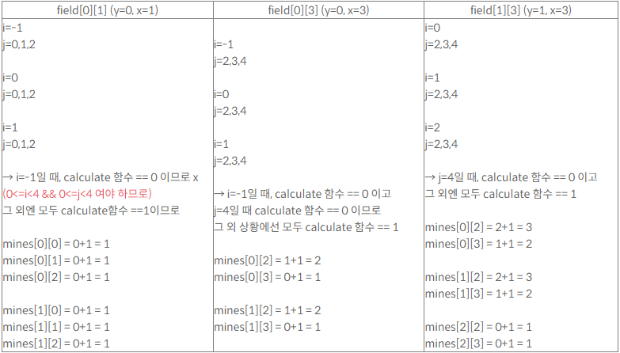

# TIL 240217 정처기
# 22년03월05일자 점수 : 95 90 80 75 85 85
# 21년08월14일자 점수 : 75 55 55 65 60 62

# 자료구조
- 자료구조란 논리적으로 설계된 데이터 구조임
- 데이터용량과 실행시간을 최소한으로 해야함
- 단순 구조, 선형 구조, 비선형 구조, 파일구조 등이 있음
    - 단순 구조 : 정수나 실수, 문자등의 데이터임
    - 선형 구조 : 데이터들의 대응관계가 1대1인 경우임 순차,연결로 나뉨, 스택, 큐, 데크, 선형 리스트, 연결리스트가 있음
        - 순차 구조 : 데이터 탐색 속도가 우선임
        - 연결 구조 : 데이터 이동이 우선임
    - 비선형 구조 : 데이터의 대응관계가 1대다인경우임, 트리,그래프가 있음
    - 파일 구조 : 보조기억장치에 실제로 데이터가 기록될 때 활용함, 순차파일, 직접파일, 색인순차파일 등이 있음
**탐색**
- 탐색은 원하는 데이터를 찾는거임
- 내부탐색, 외부탐색으로 나뉨
    - 내부 탐색 : 주기억 장치(cpu) 탐색, 적은 양의 데이터를 빠르게 탐색
    - 외부 탐색 : 주기억, 보조기억장치 함께 탐색, 많은 양을 느리게 탐색
- 종류가 꽤 많음
    - 선형 탐색 : 대상 데이터를 처음부터 순차적으로 비교해서 탐색
        - **정렬이 안되도 사용가능**
        - 데이터 수가 적을때 활용 가능함
        - N개의 데이터를 가진 자료구조의 선형탐색 평균비교횟수 : (N+1)/2
        - 시간복잡도는 최악의 경우를 보여주기에 O(N)임
    - 이분 탐색 : 대상 데이터를 절반씩 나누어서 탐색
        - **정렬이 되어야만 사용가능**
        - 데이터 개수 파악, 데이터 정렬이 반드시 되어야함
        - 시간복잡도는 O(logN)
    - 보간 탐색 : 찾을 값의 위치값을 예상해서 검색하는 사전식 탐색
        - 시간 복잡도는 O(log(logN))임
    - 블록 탐색 : 대량의 데이터를 그룹별로 블록화 해서 인덱싱을 통해 탐색
        - N개의 데이터를 가진 자료의 가장 이상적인 블록갯수는 N임
        - 블록별 가장 큰값을 써서 인덱스를 생성
        - 블록 내부 데이터는 다음 블록 최소값보다 작아야함
        - 내부 요소는 **정렬안해도 됨**
    - 이진 트리 탐색 : 검색 대상 데이터를 이진 트리로 변형한 뒤에 탐색
        - 시간 복잡도는 O(logN)임
    - 해싱 탐색 : 해싱 함수를 사용하여 데이터 탐색
        - 어떤 해시 함수를 사용해야하는지가 문제로 나옴
        - 시간 복잡도는 O(1)임
        - 해싱 함수를 통해 결정된 저장 위치가 충돌(중복)할 경우에는 조치가 필요함
        - 관련 용어들
            - 해시 테이블은 홈 주소와 버킷,슬롯으로 구성됨
            - 해싱 함수는 키를 입력받아 계산한 결과를 데이터가 저장될 홈 주소로 사용함
            - 홈 주소 : 해시 테이블의 내부 인덱스
            - 키 : 데이터 레코드 중 해싱 함수의 입력값이 되는 데이터
            - 버킷 : 슬롯들의 집합, 하나의 홈 주소에 여러개가 존재가능
            - 슬롯 : 하나의 데이터를 저장할 수 있는 공간
            - 해시 테이블 : 다수의 홈 주소와 버킷으로 구성된 기억 공간, 해시 함수의 참조 대상
            - 동의어(Synonym) : 충돌이 일어난 슬롯의 집합
            - 충돌(Collision) : 서로 다른 슬롯이 같은 키를 가지는 현상
            - 프로빙 : 충돌이 발생한 데이터를 다음 버킷(1차)이나 멀리 떨어진 버킷으로 이동
            - 체인법 : 오버플로우 해결을 위해 슬롯을 연결리스트 형태로 연결함 
        - 해시 함수의 종류
            - 제산법 : 키를 특정 값으로 나눈 나머지 값을 이용해 저장 위치를 결정함
            - 폴딩법 : 키를 여러 부분으로 나누어 부분별 순차의 합연산, XOR연산의 결과로 저장 위치 결정
            - 제곱법 : 키를 제곱한 결과의 일부분으로 저장 위치 결정
            - 숫자 분석법 : 키의 숫자 분포가 고른 부분을 분석하여 저장 위치 결정
            - 기수 변환법 : 키의 값을 다른 진법으로 변환하여 저장 위치 결정
            - 무작위법 : 난수를 이용하여 저장 위치를 결정
        - 해시 함수는 충돌을 최소화할 수 있어아만 함
**시간 복잡도**
- 탐색과 같은 알고리즘을 수행할 때, 연산이 수행되는 횟수를 나타냄
- 일반적으로 빅오(O)표기법을 이용함 
- O(1) : 데이터 수와는 관계없이 **일정한 수행 횟수**를 가지는 최고의 알고리즘임 여기서 1은 한번만 수행하는게 아니라 고정적인 연산 횟수라는 뜻
- O(logN) : 데이터 수에 따라 연산 횟수가 늘어나는 폭이 점점 줄어듬, 이분탐색, 이진트리탐색에 사용함
- O(N) : 데이터 수에 따라서 연산 횟수가 일정하게 증가(비례)함, 선형 시간 알고리즘이라고 부름, 수열이나 순차 탐색에 사용함
- O(NlogN) : 데이터 수에 따라서 연산 횟수가 늘어나는 폭이 점점 커짐,
퀵 정렬, 힙 정렬, 병합 정렬에 사용함 
- O(N^2) : 데이터 수에 따라서 연산 횟수가 데이터 수의 제곱만큼 필요함, 버블 정렬, 선택 정렬에 사용함, 비효율적이지만 구현이 쉬워서 많이 씀
- O(2^N) : 데이터 수에 따라서 연산 횟수가 데이터 수의 지수승만큼 필요함, 재귀 호출에 사용함
- O(N!) : 데이터 수에 따라 연산 횟수가 데이터 수의 팩토리얼만큼 필요함, 가장 느린 알고리즘임, 입력값이 조금만 증가해도 계산이 힘듬
**정렬**
- 데이터를 순서대로 나열하는거임
- 오름차순은 1234 처럼 수가 커짐
- 내림차순은 4321 처럼 수가 작아짐
    - 선택 정렬 : 정렬 대상 중에서 기준값으로 선택된 데이터(보통 맨앞)를 나머지랑 비교함
        - 선택 데이터 > 나머지 데이터 최소값이면 바꿈
        - 선택 데이터 < 나머지 데이터 최소값이면 유지함
        - 정렬이 끝나면 첫번째에는 가장 작은값이 와야함 이거 빼고 반복해서 반복함
        - 반복할 때마다 시작되는 위치는 계속 증가함
        - 시간 복잡도는 (N^2)임 
    - 버블 정렬 : 기준값으로 지정한 값이랑 바로 다음값만 비교함
        - 기준값 > 오른쪽이면 바꿈
        - 기준값 < 오른쪽이면 유지함
        - 정렬이 끝나면 오른쪽에 가장 큰데이터가 와야함 이거 빼고 다시 반복함
        - 반복할 때마다 종료되는 위치가 감소함
        - 시간 복잡도는 O(N^2)임
    - 삽입 정렬 : 정렬 대상 중에서 좌측에 이미 정렬된 요소랑 비교해서 자신의 위치를 찾아서 삽입함
        - 두번째부터 시작함
        - 데이터 삽입하면 나머지는 오른쪽으로 밀려남
        - 시간 복잡도는 O(N^2)임
    - 쉘 정렬 : 삽입정렬 보완형임, 데이터 간격을 정하고 간격을 줄이면서 삽입정렬을 진행함
        - N개의 데이터를 가진 자료구조의 간격을 구하는 공식 : 1.72^3루트3
        - 데이터 수가 적거나 보편적 상황에서 공식 : N/2
    - 힙 정렬 : 정렬 대상을 완전 이진트리로 만들어서 정렬함
        - 자식노드가 부모노드가 크면 자료를 교환함
        - 최대값, 최소값을 비교적 쉽게 추출할 수 있음
        - 시간 복잡도는 항상 O(NlogN)임
    - 이진 병합 정렬 : 두 데이터를 한 쌍으로 병합하여 정렬하고, 정렬된 두 그룹을 다시 한쌍으로 만들어서 정렬을 반복함
    - 버킷 정렬 : 정렬 대상의 데이터 범위를 균등하게 나눈 여러 버킷을 만들어서 정렬함, 스택을 사용함, 데이터 범위 파악이 되야만 함
    - 퀵 정렬 : 기준값을 기준으로 2개의 비균등(같은값이 아닌) 크기의 배열로 분할해서 정렬함
        - 분할 정복 알고리즘을 적용해서 매우 빠름
        - 기준값을 이상적으로 선택하면 NlogN이지만 **최악은 O(N^2)임**
        - 분할 : 기준값(pivot)을 기준으로 큰 값은 오른쪽, 작은 값은 왼쪽의 부분 배열로 분할함
        - 정복 : 부분 배열을 다시 분할, 적절한 크기가 되면 정렬함
        - 결합 : 정렬된 부분 배열들을 하나로 결합함
# 연계 데이터 구성
**통합 구현 개념**
- 통합 구현은 사용자 요구사항을 해결하기 위한 새로운 서비스 창출을 위해서 모듈간의 연계와 통합을 구성하는 것임
- 주로 송수신 시스템, 중계 시스템 및 연계 데이터와 네트워크가 있음
**송신시스템**
- 전송하고자 하는 데이터를 생성함
- 일반적으로는 데이터 생성 처리만 구현해놓음
**중계시스템**
- 내외부 시스템간의 연계할때 씀
- 송신시스템에서 받아서 수신시스템으로 보내주는 역할임
- 구간을 분리함으로써 보안성이 강화되고 인터넷 망을 연결할 수 있음
- 주로 데이터의 오류 처리나 데이터 변환, 매핑을 처리하는 역할임
**수신시스템**
- 중계시스템에게서 데이터를 받아서 처리함
**연계데이터**
- 송수신할때 쓰는 데이터를 연계데이터라고 함
- 속성,길이,타입 등이 포함되어 있음
- 표준화 절차
    - 연계 범위 및 항목 정의 > 연계 코드 매핑 및 정의 > 변경된 데이터 구분방식 정의 > 데이터 연계 방식 정의
    - 연계 범위 및 항목 정의 : 시스템 간 연계하려는 정보를 상세화함
    - 연계 코드 매핑 및 정의 : 코드로 관리해야하는 항목을 변환함, 주로 송신코드를 수신코드로 매핑, 송수신시스템에서 사용하는 코드 표준화 후 매핑이 있음
    - 변경된 데이터 구분방식 정의 : 정의와 표준화가 완료된 정보를 시스템에 반영하기 위해 연계 데이터 식별자와 변경 구분을 추가함, 추가되는 정보는 식별자, 변경구분, 관리정보가 있음
        - 식별자(primary key) : 데이터를 유일하게 식별할 수 있는 이름
        - 변경 구분: 송신 정보를 수신 시스템의 테이블에 어떻게 반영(추가,수정,삭제)할지 식별함
        - 관리 정보 : 연계 정보의 송수신 여부, 일시, 오류 코드 등의 모니터링을 위한 벙보
    - 연계 데이터 표현방식 정의 : 연계 데이터를 테이블이나 파일의 형식으로 구성함, 파일로 구성하면 파일 형식에 따라서 상세화 함
        - XML, JSON, TEXT 등이 있음
        - XML : 사용자가 임의로 생성한 태그를 통해 상세화
        - JSON : XML을 대체하는 독립적인 자바스크립트 기반 표준형식임 AJAX기술에서 많이 씀
        - TEXT형식 : 항목 분리자(콤마,콜론,세미콜론) 등을 통해 상세화함
# 연계 매커니즘
**직접연계**
- 중간 매개체 없이 송신 시스템과 수신 시스템이 직접 연계되는 방식임
- 장점 : 연계 및 통합 구현이 단순함, 개발 비용이 저렴함, 성능이 좋음
- 단점 : 높은 결합도 때문에 인터페이스 변경이 제한적임, 보안이나 로직이 안좋음
**간접연계**
- 연계 솔루션과 같은 중간 매개체를 사용해서 연계함
- 장점 : 다양한 환경에 유리함, 보안이나 로직이 좋음, 인터페이스 수정이 가능함
- 단점 : 매커니즘이 복잡함, 적용하려면 테스트 해야해서 오래걸림, 성능이 구림
# 연계 기술 표준
**EAI(Enterprise Application Intergration)**는 
- 서로 다른 기종의 시스템 간의 연동을 가능하게 해주는 **전사적** 애플리케이션 통합 환경임
- 송수민 어댑터(모듈)을 통해 메시지 변환이 가능하며 서로 다른 코드나 프로토콜을 사용하는 시스템간 통신이 가능함
**Point to Point**
- 미들웨어 없이 애플리케이션 간 **직접 연결**하는 방식임
- 연계 솔루션 없이 단순한 통합이 되지만, 시스템 변경이나 재사용이 어려움
- 사실 EAI는 아님
**Hub & Spoke(EAI)**
- 단일 접점 시스템(허브)를 통해 데이터를 전송하는 중앙 집중형 연계 방식임
- 확장 및 유지보수가 유리하지만, 허브 자체가 먹통이면 전체가 문제임
**Message Bus(ESB : Enterprise Service Bus)**
- 송수신 시스템 사이에 미들웨어(BUS)를 놓아서 확장성과 처리량이 향상됨
- 별도의 어댑터가 필요없으며 관리 및 보안이 용이함, 서비스 중심의 통합 지향함
- 표준화가 어렵고 성능이 안좋음
- 간접연계 방식이 두드러짐
**EAI/ESB(Hybrid)**
- 허브앤스포크를 사용하는 그룹과 그룹간에는 ESB를 적용하는 방법임
- EAI(허브)를 사용하는 그룹과 그룹을 미들웨어로 연결하기 때문에 안정성이 올라감
# 연계 테스트
- 연계 테스트는 구축된 연계 시스템과 연계 시스템의 구성 요소가 정상적으로 동작하는지 확인하고 검증하는 거임
- 송수신 시스템 사이의 연계 테이블 간 테스트를 수행한 뒤에 연계 데이터를 추출 및 반영하는 테스트를 진행함
- 연계 업무의 단위테스트, 연계 테스트, 통합 테스트를 순차적으로 진행함
- 단위테스트는 간단히 말해서 업무 단위의 기능을 테스트함
- 연계 테스트는 연계가 잘 되는지 테스트함
- 통합 테스트는 시스템을 통합했을 때 문제가 없는지 테스트함
- 연계 시스템 구현 검증 도구는 다음과 같음
        - xUnit : 자바나 씨플플 등 다양한 언어를 지원하는 단위 테스트 프레임워크
        - STAF : 서비스 호출, 컴포넌트 재사용 등 다양한 환경을 지원하는 테스트 프레임워크
        - FitNesse : 웹 기반 테스트 케이스 설계/실행/결과 확인을 지원하는 테스트 프레임워크
        - NTAF : STAF와 FitNesse 를 통합한 프레임워크
        - Seleniym : 다양한 웹 지원 및 개발언어를 지원하는 웹 어플리케이션 테스트 프레임워크
        - watir : Ruby(언어)기반 웹 어플리케이션 테스트 프레임워크
# 소프트웨어 테스트
- 잠재적인 결함을 줄여나가지만, 모든 결함을 없앨 순 없음
**테스트 진행을 위한 테스트원리**
    - 결함 집중 : 결함의 대부분은 특정 모듈에 집중되어 존재함
    - 낚시의 법칙 : 낚시 포인트처럼 특정 위치에서 많은 결함 발생
    - 파레토의 법칙 : 결함의 80%는 20%의 기능에서 발생
    - 살충제 패러독스 : 동일한 테스트 케이스로 반복 실행하면 결함의 발견이 불가능함 즉 개선해야함
    - 오류 부재의 궤변 : 결함이 없어도 요구사항을 만족 못하면 품질 보증이 불가능함
**테스트 절차**
- 테스트 계획 > 테스트 분석 및 디자인 > 테스트 케이스 및 시나리오 작성 > 테스트 수행 > 테스트 결과 평가 및 리포팅
- 산출물은 계획서, 케이스, 시나리오, 결과서 등이 있음
**테스트 유형**
- 테스트는 정적테스트와 동적테스트로 나뉨
- 정적 테스트 : 프로그램 실행 없이 소스코드의 구조를 분석함(인스펙션,동료검토,워크스루 등)
- 동적 테스트 : 프로그램을 실행화면을 보면서 테스트를 수행함(화이트박스, 블랙박스)
    - 화이트박스는 프로그램의 내부 로직(경로구조, 루프 등)을 중심으로 테스트함
    - 블랙박스는 프로그램의 기능(요구사항여부, 결과값)을 중심으로 테스트함
**테스트 검증(Verification)은 개발자 입장에서 개발 과정에 대한 테스트임**
**테스트 확인(Validation)은 사용자 입장에서 개발 결과에 대한 테스트임** 
**목적 기반 테스트**
- 제품 소프트웨어의 **특정 특성을 파악하기 위한 목적**으로 테스트를 진행함 종류가 많음
    - 회복 : 실패를 유도하여 정상 복귀가 가능한지 테스트
    - 안전 : 소스 코드 내의 보안 결함에 대한 테스트
    - 강도 : 과부하 시에도 시스템이 정상 작동하는지 테스트
    - 성능 : 응답시간, 처리량, 반응속도 등의 테스트
    - 구조 : 시스템 내부 로직, 복잡도 등을 테스트
    - 회귀 : 변경된 코드에 대한 새로운 결함 여부 테스트
    - 병행 : 변경된 코드에 기존과 동일한 테스트 진행 후 결과 비교
**설계 기반 테스트**
- 테스트 진행의 기반이 되는 자료에 따라서 나뉨
    - 명세 기반 테스트 : 주어진 명세를 기반으로 테스트 케이스를 구현하여 테스트함
    - 구조 기반 테스트 : 소프트웨어의 내부 로직을 기반으로 테스트함
    - 경험 기반 테스트 : 유사한 테스트를 진행했던 테스트의 경험을 기반으로 테스트함
**화이트박스 테스트**
- 기초경로 테스트가 있음
    - 맥카베가 제안함, 대표적인 화이트박스기법임
    - 설계서나 소스코드를 기반으로 흐름도를 작성하여 논리적 순환 복잡도를 측정함
    - 측정된 결과를 기반으로 실행 경로의 복잡도를 판단함
        - 복잡도 = 간선수 - 노드수 + 2 복잡도가 5이하는 단순, 6~10 안정적, 11~19 일반적, 20~49 매우복잡, 50이상은 불안정함으로 분류함
- 제어구조 검사가 있음
    - 소스코드 내의 제어구조(if문이나 for문 등)들에 대한 테스트 기법이다
    - 조건 검사 : 논리식(조건)을 중심으로 테스트
    - 루프 검사 : 반복 구조를 중심으로 테스트
    - 데이터 흐름 검사 : 변수의 정의와 사용을 중심으로 테스트
**블랙박스 테스트**
- 동등분할 테스트
    - 입력 조건에 **유효한 값과 무효한 값을 균등하게** 하여 테스트 케이스를 설계함
- 경계값 분석
    - 입력 조건의 **경계에서 오류가 발생할 확률이 높다**는 점을 이용하여 입력조건의 경계값을 테스트 케이스로 정함
- 원인 효과 그래프 테스트
    - **입력 데이터 간의 관계와 출력에 미치는 영향을 분석**하여 효용성이 높은 테스트 케이스를 설계함
- 오류 예측
    - 과거의 경험이나 확인자의 감각에 의존하여 테스트 케이스를 설계함
- 비교 테스트
    - 여러 버전의 프로그램에 동일한 테스트 자료를 제공하여 테스트하는 기법임
**테스트 케이스 작성 절차**
- 테스트 계획 검토 및 자료 확보 > 위험 평가 및 우선순위 결정 > 요구사항 정의 > 구조 설계 및 테스트 방법 결정 > 테스트 케이스 정의 > 테스트 케이스 타당성 확인 및 유지보수
**테스트 오라클**
- 테스트 오라클은 테스트 결과가 참인지 거짓인지를 판단하기 위해서 사전에 정의된 참값을 입력하여 비교하는 기법 및 활동임 
    - 참 오라클 : 모든 입력값에 대해서 기대 결과를 생성함
    - 샘플링 오라클 : 특정 몇개의 입력값에 대해서만 기대 결과 제공함
    - 휴리스틱(추정) 오라클 : 샘플링 오라클을 개선한 것임, 특정 입력값에 대해 기대결가를 제공하고, 나머지는 추정으로 처리함
    - 일관성 검사 오라클 : 애플리케이션 변경이 있을때, 수행 전과 후의 결과값이 동일한지 확인함
- 주로 참 오라클은 미션 크리티컬한 업무에 적용함, 샘플링이나 휴리스틱은 일반업무나 게임 등의 업무에 적용함
- 미션 크리티컬이라 함은 항공기나 발전소 같이 조금만 결함이 있어도 치명적인 결과를 발생시킬수 있는 업무임
# 통합 테스트 수행
**V모델**
    - 개발 단계별로 검증하고 수행해야하는 테스트를 시각화한 모델임
    
    - 단위 테스트 
        - 소프트웨어 설계의 최소 단위인 모듈의 기능을 중심으로 테스트함
        - 모듈의 기능 수행여무와 논리적인 오류를 검출함
        - 일반적으로 화이트박스로 하는데 블랙박스도 안되는건 아님
    - 통합 테스트 
        - 소프트웨어의 각 모듈간의 인터페이스 관련 오류 및 결함을 잡기위한 테스트 기법의 총장임
        - 단위 테스트가 끝난 모듈 단위의 프로그램이 설계 단계에서 제시한 어플리케이션과 동일한 구조와 기능으로 구현되었는지 확인하는 거임 > 즉 만든게 설계대로 잘 됐나 확인
        - 통합 테스트는 점증적 방식과 비점증적 방식으로 나뉨
            - 비점증 : 전체 프로그램을 한번에 테스트(빅뱅이라고 함)
            - 점증 : 통합 단계별로 테스트 수행(하향식 통합Top Down, 상향식 통합Bottom Up이 있음)
                **하향식 통합**
                    - **메인 제어 모듈을 시작**으로 제어의 경로를 따라서 아래방향으로 이동하면서 테스트함
                    - 깊이 우선과 너비 우선이 있음
                        - 깊이 우선 : 해당 모듈에 종속되어있는 모듈을 우선 탐색함
                        - 너비 우선 : 해당 모듈과 같은 레벨에 위치한 모듈을 우선 탐색하는 기법
                    - 메인 제어 모듈은 작성된 프로그램을 활용하고, 아직 통합되지 않은 하위 모듈은 stub을 써서 테스트함
                        - stub : 상위 모듈의 **테스트를 위한 최소한의 기능만 가지는 더미 모듈**임 
                    - 하향식은 시각화가 가능하지만 테스트 케이스 사용이 어려움
                    - stub을 써서 테스트 할떄는 정상이었는데 실제로 통합하면 오류 나올 수도 있어서 **회귀테스트** 꼭 해야함
                **상향식 통합**
                    - 어플리케이션 구조에서 **최하위 모듈을 시작**으로 제어의 경로를 따라 위쪽방향으로 이동하면서 테스트함
                    - 테스트 대상 모듈의 상위 모듈에 종속되어있는 하위 모듈 그룹을 클러스터화 해서 테스트를 진행함
                    - 클러스터화된 하위 모듈들의 상위 모듈에 대해서는 데이터 입출력을 확인하기 위한 Driver를 작성해서 진행함
                    - Driver : 테스트 단계에서 **존재하지 않는 상위 모듈의 역할을 하는 더미 모듈**임
    - 시스템 테스트
        - 개발한 소프트웨어가 컴퓨터 시스템에서 완벽하게 수행되는지 확인하는 테스트임
        - 기능적 요구사항과 비기능적 요구사항으로 구분해서 테스트함
    - 인수 테스트
        - 사용자 요구사항 충족 여부를 **사용자(손님)가 직접 테스트** 함
        - 알파테스트와 베타테스트가 있음
            - 알파 : 개발자의 장소에서 진행, 개발자랑 손님이 같이 문제점 발견함
            - 베타 : 제한되지 않는 환경에서 테스트, 개발자에게 문제점을 통보함
**테스트 자동화 도구**
- 정적 분석 도구 
    - 어플리케이션을 실행하지 않고 분석하는 도구임, 코드 결함을 발견하기 위해 사용
- 테스트 실행 도구
    - 테스트를 위해 작성된 스크립트를 실행하는 도구임,
- 성능 테스트 도구
    - 말 그대로 성능을 확인하기 위한 도구임, 처리량, 응답시간, 경과시간, 자원 사용률을 테스트함
    - 결과 해석하는데 전문가가 필요할 수도?
- 테스트 통제 도구
    - 테스트 계획 관리를 위한 도구임, 테스트 관리 도구, 형상 관리 도구, 결함 추적/관리 도구 등이 있음
- 테스트 하네스
    - 테스트를 지원하기 위한 코드와 데이터들의 총칭임
    - 테스트 하네스는 Test Driver와 Test Stub 포함해서 이렇게나 많음
    - 테스트 스위트 : 테스트 대상 컴포넌트나 모듈 시스템에 사용되는 테스트 케이스의 집합
    - 테스트 케이스 : 입력값, 실행 조건, 기대 결과 등의 집합
    - 테스트 스크립트 : 자동화된 테스트 실행 절차에 대한 명세
    - 목 프로젝트 : 사용자의 행위를 조건부로 사전에 입력한 것을, 그 상황에 예정된 행위를 수행하는 객체임
