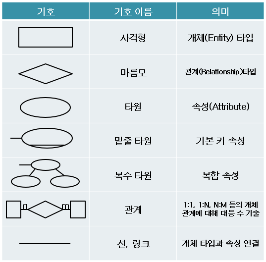
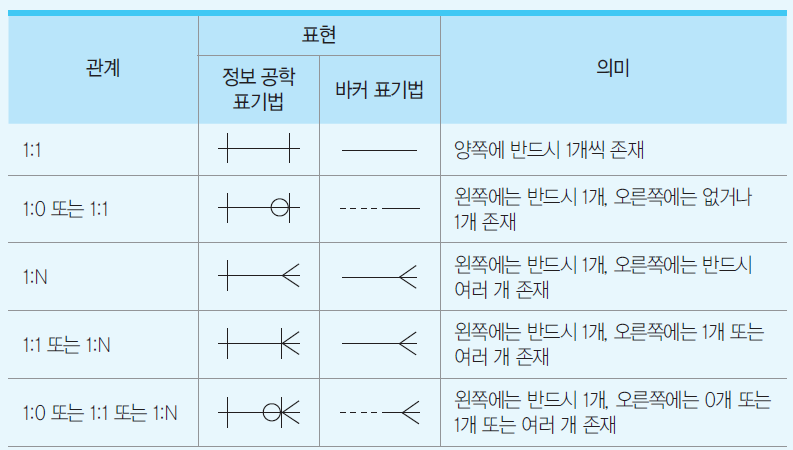

# TIL 240217 정처기
# 21년08월14일자 점수 : 90 85 70 85 70 80
# 21년05월15일자 점수 : 65 80 55 40 35 55

# 스키마 
- 스키마는 데이터베이스의 자료구조와 표현방법, 관계등을 정의한 **제약조건**임
- dbms와 db구축 환경을 고려해서 정의되고 데이터사전에 저장됨
- **외부, 개념, 내부** 스키마로 나뉨
- 외부스키마(여러개 존재) > 개념 스키마 > 내부 스키마 > DB순으로 저장됨
**외부스키마**
- **특정 사용자의 입장**에서 필요한 데이터베이스의 구조를 정의한 스키마임
- 같은 db에서도 **서로 다른 관점을 정의**하기 떄문에 **다양한 외부스키마**가 나올수도 있고, 사용자가 선택해서 이용할 수 있음
- A는 어떤식 어떤식으로 db를 이용할거다 라는 식임
**개념스키마**
- **모든 사용자의 입장**에서 필요한 데이터베이스의 구조를 정의한 스키마임
- 접근권한 보안정책 무결성 규칙 등이 포함된 db전체를 정의함
- DBA에 의해 구성되고 db당 **단 한개임**
**내부스키마**
- 물리적인 저장장치 입자에서 데이터베이스가 저장되는 방법이나 구조를 정의한 스키마임
- 기억장치에 데이터를 물리적으로 구현하기 위한 방법(내부형식, 물리적 순서 등)을 정의함
- 내부스키마의 내용에 따라서 데이터를 구현해서 운영체제의 파일시스템에 의해 저장됨
**DBMS 데이터베이스 메니지먼트 시스템**
- 정의 조작 제어 기능이 있음
- 정의 : 데이터의 논리적, 물리적 구조 정의
- 조작 : 데이터 조회, 생성, 삭제, 변경 등의 조작
- 제어 : 동시성 제어(데이터 동시 사용 관리), 보안과 권한 기능
**DB 시스템 유형**
    **파일시스템** : 자료에 쉽게 접근할 수 있도록 논리적인 파일 단위로 관리하는 시스템임
    **HDBMS(Hierarchical DBMS)** : 데이터를 계층화해서 관리함, 접근속도가 빠르지만, 구조 변화에 유연한 대응이 어려움, 1대 다 관계이며, 다대 다 관계는 표현이 힘듬
    **NDBMS(Network DBMS)** : 데이터를 네트워크 형태로 관리함, 상하 종속관계 해결이 가능하지만, 구성이 복잡하고, 데이터 종속성을 해결 못함, 1대다부터 다대다 까지 모두 표현 가능
    **RDBMS(Relational DBMS)** : 데이터를 **테이블구조**로 모델링 해서 관리함, 적응력이좋아서 유지보수와 생산성이 좋음, 테이블을 기준으로 상호간의 관계를 설정함, 시스템의 부하가 큼
        **개체 타입(Entity Type)** : 현실세계의 개념이나 대상을 db로 표현하고자 하는 **논리적인 표현 단위**임, 다수의 속성으로 표현됨, 릴레이션(표)에 해당하며 테이블 형태로 표현함
            - 개체 : 개체 타입의 규칙을 통해서 **생성된 대상**으로, 파일 시스템의 레코드와 대응함
        **속성(Attribute)** : 개체를 구성하는 고유의 특성임, 의미 있는 데이터의 가장 작은 논리적 단위임, 속성 자체만으로는 의미가 없지만 관련있는 속성을 모아서 개체를 만들 수 있음, 한개의 **속성값은** 파일 시스템에서 **필드**를 의미하고, 테이블의 열(컬럼)에 해당함 > 속성과 속성값은 반드시 구분해야함 
        **도메인(Domain)** : 하나의 속성값이 가질 수 있는 **모든 원자(분해할 수 없는)값의 집합**임, 성별 속성에서 남, 여 같이 더 이상 나눌 수 없는게 도메인임
        **튜플(Tuple)** : 하나의 개체(레코드)를 표현하는 완전하고 고유한 정보 단위임, 각 튜플은 **고유해야 하고 순서가 없어야 함**, 튜플은 행(Row)에 해당하고 **릴레이션 인스턴스**라고도 부름 > 어디선가 복사되었다는 뜻
        **릴레이션(Relation)** : 개체에 대한 데이터를 속성과 튜플로 구성된 2차원테이블의 구조로 표현한 거임, **릴레이션 스키마랑 릴레이션 인스턴스를 합쳐**서 만듬
            - 릴레이션 스키마 : 릴레이션에 포함된 속성명 집합
            - 릴레이션 어커런스 : **릴레이션 인스턴스랑 같은 뜻**임
            - 차수(열, Degree 깊이) : 전체 속성 개수
            - 기수(행, Cardinality 넓이) : 전체 튜플의 개수
            - Null : 정보 없음
**키**
- 키는 데이터를 분류하거나 검색할 떄 기준이 되는 속성임
- 후보키, 기본키, 대체키 ,슈퍼키, 외래키가 있음 > 기본적으로 후보키라는 큰 틀안에 기본키, 나머지로 나뉨
    **후보키(Candidate Key)** : 릴레이션에 존재하는 모든 튜플에 대해 **유일성과 최소성**을 모두 만족시키는 속성임, 이름은 보통 겹치니까 누가 누군지 구별이 불가능 그럼 > 구분이 가능하게 하는 주민번호가 후보키임
        - 유일성 : 중복 없음, 튜플을 유일하게 구분할 수 있는 성질
        - 최소성 : 가장 적은 수의 속성(한개)로만 구성되는 성질
        - 학생 테이블의 후보키는 학번, 주민번호, 연락처 등이 가능함
    **기본키(Primary Key)** : 후보키들 중에서 튜플의 식별을 위해 지정된 속성임, 유일성과 최소성을 만족해야 함
    **대체키(Alternate Key)** : 기본키로 지정된 속성을 제외한 후보키들
    **슈퍼키(Super Key)** : 슈퍼키는 후보키나 대체키랑은 조금 다름, 최소성은 불만족하지만 유일성은 만족함, 유일성을 만족하는 속성이 없을 때, 둘 이상의 속성을 합쳐서 튜플을 식별할 수 있게 만든거임
        - 전화번호로 식별할려는데 전화번호도 겹치면 이름까지 적음 > 여기서 전번 + 이름이 슈퍼키임
    **외래키(Foreign Key)** : 관계된 다른 릴레이션의 기본키를 참조하는 속성임, 기본키를 참조하는데 키의 유일성을 만족 안할수도 있음 > 중복이 될수도 있고 NULL을 넣을수도 있는 키임
# 데이터 모델링
- 전략 수립   >    분석      > 설계        > 개발                              > 운영 시스템 순임
- 개념 모델링 >    분석모델링 > 설계 모델링 > 애플리케이션 개발, 데이터베이스 구축 > 애플리케이션, 데이터베이스 
- 개념 스키마 산출 > 논리 스키마 산출 > 물리 스키마 산출
**개념 데이터 모델링**
- 비즈니스 요구사항을 표현한 상위 수준의 모델로, 데이터 모델의 골격을 설계함
- 주요 엔티티타입, 기본 속성 등의 골격을 세움
- 업무영역에 포함되는 주요 엔티티 간의 관계를 파악해야함
- **독립적인 표현**이 가능한 모델을 이용함 주로 E-R다이어 그램 > ER만 가능한게 절대 아님
- 순서보다는 필수 요소로 이해하는게 좋음
**논리 데이터 모델링**
- 개념 데이터 모델을 기초로 해서 업무 영역의 업무 데이터 및 규칙을 구체적으로 표현함
- 모든 업무 영역에 대한 업무용 개체 등을 포함함
- 표현 방법에 따라서 관계형, 계층형, 네트워크형 모델이 있음
- 개념적 구조를 논리적 구조로 변환(매핑)함
- 특정 DBMS를 목표로 적용할 수 있는 스키마와 인터페이스를 설계해야함 > 종속됨
- 요구사항을 충분히 수집 안하면 요구사항 변경할 때 돈이 많이 듬
- 시스템으로부터 독립적임
- E-R모델 씀
- 모든 업무 데이터를 정규화함
# 논리 개체 관계 정의
- 둘 이상의 개체의 존재나 행위에 있어서 의미가 있는 연결 관계임 
- 존재에 의한 관계는 학교와 학생
- 행위는 고객과 주문개체
- 적절한 관계는 개체간 **참조 무결성을 보장**함 무결성 : 일관성을 유지하는 것
- 1대0, 1대1, 1대다 등 여러 관계로 표현됨
# E-R다이어그램
- 피터챈이 만듬
- 개와 개체간 관계를 미리 약속한 도형을 써서 알아보기 쉬움
- 개념, 논리데이터 모델링에서 많이 씀
- 개체 관계 속성의 구성요소가 있음
- 시스템 환경을 고려하지 않음
- 완성도가 좋으면 업무 수행 방식의 변경에 영향을 안받는데, 업무 영역이 변경되면 설계 변경이 발생할 수도 있음
**피터 챈 표기법**

**정보 공학 표기법**

**확장 ER다이어그램**
- 기존 ER에서 재사용,상속,확장성 등의 개념을 적용함
    **일반화와 구체화**
    - 일반화는 다수의 하위 개체타입을 상위 개체의 유형간 부분집합으로 표현함
    - 구체화는 개체 타입을 다수의 하위 개체타입으로 분리하는 하향식 설계 방식임
    - 하위 개념으로 내려갈 수록 구체화되고, 상위 개념으로 올라갈수록 일반화 됨
    - 컴퓨터는 데탑, 노트북, 핸드폰 이 있음 > 여기서 컴퓨터가 일반화 , 3가지 종류로 나뉘는게 구체화
    **집단화와 분해화**
    - 집단화는 특정 유형과 관련있는 개체 타입들을 통해 새로운 개체 타입을 생성함
    - 분해화는 개체의 결합으로 이루어진 개체를 다시 나누는거임
    - 컴퓨터는 cpu, 메모리, 그래픽카드로 나뉨 > 컴퓨터를 분해하면 3가지 부품, 부품 3를 합치면 집단화
    **분류화와 인스턴스화**
    - 분류화는 특정 유형을 공통적으로 가지는 하위 개체들을 묶어 하나의 사우이 개체로 만드는거임
    - 인스턴스화는 한개의 특성을 기본으로 하는 여러 형태의 개체를 생성함
    - 사원관리에서의 사람 : 부서 유형으로 분류화
# 데이터 종속성
- 데이터 종속성은 데이터와 다른 데이터가 **의존관계**에 있는 특성임, 예를 들어 A가 삭제되면 B도 삭제됨 왜? B는 A에 의존하니까 관계형 모델 설계할 때 매우 중요
- 데이터 종속성 때문에 무결성이 훼손될 수 있음
**함수종속**
- 한 속성이 **다른 속성을 유일하게 식별할 수 있는 상태**의 종속성임
- A만이 B를 유일하게 식별할 수 있으면 그것은 B는 A에 함수적으로 종속된거임
- A->B로 표현 또는 B=F(A)
- A만이 C,D를 유일하게 식별하면? A->C,A->D 또는 A->{C,D}
- 여기서 A는 결정자, B는 종속자임
    - 결정자 : 종속성 규명의 기준이 되는 속성
    - 종속자 : 결정자에 의해 값이 정해지는 속성
**폐포**
- 특정 속성에 종속되었다고 추론이 가능한 모든 속성의 집합임
- 회원번호 속성의 폐포는 회원번호+라고 씀
- 특정 속성은 자기자신도 포함됨 > 회원번호+ 는 회원번호, 이름, 연락처 등등이 있음
- 기본규칙은 꽤 많음
    - 반사(Reflexivity) : Y가 X의 부분집합 이면, X -> Y
    - 증가(Augmentation) : X -> Y이면, XZ -> YZ
    - 이행(Transitivity) : X -> Y이고, Y -> Z이면, X -> Z
    - 결합(Union) : X -> Y이고 X -> Z이면, X -> YZ
    - 분해(Decomposition) : X -> YZ 이면, X -> Y 이면서 X -> Z
    - 의사이행(Psudo Transitivity) : X -> Y 이면서 YZ -> W 이면, XZ -> W
# 정규화
- 정규화는 데이터 무결성을 유지하기 위한 장치임, 중복성 최소화 및 일관성 보장을 위해서 필요함
- 논리 데이터 모델링 상세화에서 **가장 중요**
- 데이터 모델의 정확성, 일치성, 단순성, 비중복성, 안정성 등을 보장함
- 어떻게 분해 할지 판단 기준을 제공함
- 매우 유연하게 데이터 구축이 되는데, **물리적인 접근 경로가 복잡해짐**
- 이상현상을 제거하는게 목적임 > 이상현상은 잘못된 릴레이션 설계로 예기치 못한 현상이 나타나는거임
- 정규형의 종류 반드시 외울것
    **- 비정규형 : 정규화가 전혀 진행되지 않음**
    **- 1NF(제1정규형) : 도메인이 원자값만 가지도록 분해**
        - 속성값에 두가지가 들어가면 안됨, 직무 속성값에 문서관리,총무 이러면 안되고 한개씩만 넣어놔야함
    **- 2NF(제2정규형) : 1정규를 만족하면서 부분 함수 종속 제거 > 완전 함수 종속이 되야함**
        - 기본키나 슈퍼키를 합쳐서 검색했는데 값이 안나오면 안됨
    **- 3NF(제3정규형) : 2정규를 만족하면서 이행적 함수 종속 제거**
        - 종속자 C의 결정자가 B만 있어야 되는데 A도 있음, 주인이 2개인 경우를 없애야함, 
        - A -> B, B -> C, A -> C인 경우 > C의 결정권자가 2마리가 있어선 안됨 
        - 결정자이자 종속제애 해당하는, 위에선 B->C를 기준으로 릴레이션을 분할해버리면 됨
    **- BCNF(보이스 코드 정규형) : 3정규를 만족하면서 결정자가 후보키가 아닌 함수 종속 제거**
        - 즉 모든 결정자가 후보키여야만 함
    **- 4NF(제4정규형) : 다치 종속 제거**
        - 다대다 관계를 없애는거임 > 애초에 여기까지 안옴
    **- 5NF(제5정규형) : 후보키를 통하지 않는 조인 종속 제거**
        - 릴레이션에 존재하는 모든 조인 종속성이 릴레이션의 후보키를 통해서만 성립해야함 > 릴레이션 하나를 여러개로 쪼갠다음에 다시 공통된거로 합쳐도 원본이랑 똑같아야함

# SQL
- 관계형 DBMS의 표준 언어임, 관계 대수를 기초로 만듬
**데이터 정의어(DDL,Data Definition Language)**
    - 데이터 조작을 위한 공간(DataBase Object)를 정의 수정 변경하는 언어임, 관리자가 씀, 테이블을 관리한다 생각
    - 데이터베이스 객체는 스키마, 도메인, 테이블, 뷰, 인덱스 등이 있음
    - 명령은 **CREATE, ALTER, DROP, TRUNCATE**가 있음
    - 한번 수행되면 롤백이 안됨, TRUNCATE는 객체 데이터 전체 삭제임
**데이터 조작어(DML,Data Markup Language)**
    - 사용자(응용프로그램)이 DBMS를 통해 db를 조작하기 위한 인터페이스를 제공하는 언어임, 데이터를 관리한다 생각
    - 데이터의 삽입, 갱신, 삭제, 조회가 있음
    - **INSERT, UPDATE, DELETE, SELECT** 
    - TCL을 쓰면 롤백이 가능함
**데이터 제어어(DCL,Data Control Language)**
    - 사용자의 데이터 접근 통제와 병행수행(공유)를 위한 제어 언어임, 권한을 관리한다 생각
    - **GRANT, REVOKE, COMMIT, ROLLBACK, CHECKPOINT**이 있음
    - **권한부여, 권한회수, 결과반영, 롤백, 롤백지점설정**순
