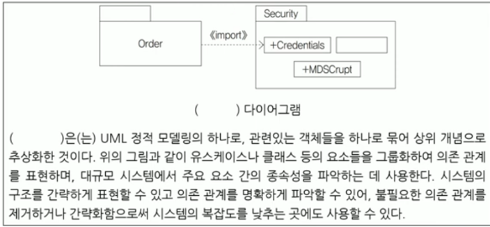

# TIL 240324 정처기 실기
# 23년 3회

### 1번
```
public class main{
    public static void main(String[] args) {
        A b = new B(); // B를 불러옴
        b.paint(); // B의 페인트
        b.draw(); // B의 드로우
    }
}
 
class A {
    public void paint() {
        System.out.print("A");
        draw();
    }
    public void draw() { //super로 불러오는 놈 
        System.out.print("B");
        draw(); // 자식의 draw 부르기
    }
}
 
class B extends A { // A를 상속받은 B
    public void paint() {
        super.draw(); // 부모 클래스의 draw 불러오기 -> B , D
        System.out.print("C"); 
        this.draw(); // 현재 클래스의 draw 불러오기 -> D
    }
    public void draw() {
        System.out.print("D");
    }
}
```

### 출력하기
// super는 자식클래스에서 부모클래스의 멤버를 참조해서 불러옴
// super()는 자식클래스에서 부모클래스의 생성자를 호출함
// super()는 자식클래스에서 만약 안쓰면 알아서 super()를 넣어서 컴파일됨, 이건 부모생성자()와 같은 의미이기 때문에 만약 파라미터가 없는 생성자가 선언되어있지 않다면 에러남
// -> 부모클래스의 생성자파라미터를 확인하고 잘 쓸것
- 정답 BDCDD


### 2번 

- 사용자가 사용자 이름 및 암호와 같은 자격 증명을 공유하지 않고도 타사 애플리케이션이 데이터 또는 리소스에 액세스할 수 있도록 권한을 부여할 수 있는 개방형 표준 프로토콜이다.

- 사용자가 데이터에 대한 제어를 유지하면서 리소스에 대한 액세스 권한을 부여할 수 있는 안전하고 표준화된 방법을 제공하며, 액세스 토큰을 사용하여 타사 애플리케이션에 리소스에 대한 액세스 권한을 부여하는 메커니즘을 사용자에게 제공하는 방식으로 작동한다.

- 사용자가 응용 프로그램에 대한 액세스 권한을 부여하면 응용 프로그램은 사용자를 대신하여 사용자의 리소스 또는 데이터에 액세스하는 데 사용할 수 있는 액세스 토큰을 받는다.

- 암호와 같은 사용자의 자격 증명은 타사 응용 프로그램과 공유되지 않으며, 클라우드 스토리지 서비스, 온라인 마켓 플레이스 및 금융 서비스를 포함한 다른 많은 응용 프로그램 및 서비스에서도 사용된다.

- Facebook, Twitter 및 LinkedIn과 같은 소셜 미디어 플랫폼에서 널리 사용되어 사용자가 소셜 미디어 데이터에 대한 액세스 권한을 타사 애플리케이션에 부여할 수 있도록 한다.

- 타사 애플리케이션에 대한 사용자 자격 증명의 노출을 최소화하여 향상된 보안, 간소화된 애플리케이션 개발, 사용자가 리소스에 대한 액세스 권한을 쉽게 부여하거나 취소할 수 있도록 하여 향상된 사용자 환경 등 여러 가지 이점을 제공한다.


```
ㄱ.NFT     ㄴ.JWT      ㄷ.SAML     ㄹ.accessToken      ㅁ.SSO
ㅂ.OIDC    ㅅ.Autentication       ㅇ. OAuth  ㅈ.Cookie     ㅊ.Refresh Token
```

- NFT : 비트코인 비슷한건데 토큰이긴함
- JWT : json web token임 말 그대로 JSON주고받음
- SAML : 아이덴티티 공급업체(IdP)에서 서비스 공급업체(SP)로 권한 인증 자격 증명을 전달할 때 사용되는 개방형 표준임. 쉽게 말해서 애플리케이션간 커뮤니케이션이 안전하게 이루어지므로 사용자가 한 개의 자격 증명 세트만으로도 액세스할 수 있음
- accessToken : JWT토큰에서 2개로 나뉘는거임, 평소에 API통신할때는 accessToken씀, 유효기간 짧음
- Refresh Token : JWT토큰에서 2개로 나뉘는 남은 하나임, AccessToken이 만료되서 갱신할 떄 씀
- SSO : Single sign on 은 1회 사용자 인증으로 다수의 애플리케이션 및 웹사이트에 대한 사용자 로그인을 허용하는 인증 솔루션임
- OIDC: SSO의 인증 솔루션 중 하나임, OIDC는 '사용자 인증 및 사용자 정보 제공(인증)'을 처리하기 위해 만듬, 주로 OAuth랑 비교됨, 용자 인증 및 사용자 정보 제공(id token)
- Autentication : 인증이라는 뜻 authorization(권한허가,승인) 과 헷갈리지 않게 조심, 로그인이 인증, 글쓰는데 레벨이 필요한건 권한허가,승인
- OAuth : 권한 허가(인가)'를 처리하기 위해 만들어진 표준 프로토콜임, 구글,페북로그인 같은 소셜로그인 할수 있게 해줌, 권한 부여(Access Token)기능
- Cookie : 서버가 사용자의 웹 브라우저에 전송하는 작은 데이터 조각임, 브라우저는 그 데이터 조각들을 저장해 놓았다가, 동일한 서버에 재 요청 시 저장된 데이터를 함께 전송함. 쿠키는 두 요청이 동일한 브라우저에서 들어왔는지 아닌지를 판단할 때 주로 사용함

### 정답
- OAUTH


### 3번 리눅스(Linux)에서 사용자에게 읽기/쓰기/실행 권한을 부여하고, 그룹에게는 읽기/실행을 부여하고, 그 이외에는 실행 권한을 test.txt 파일에 부여하는 위한 명령어는 다음과 같다. 빈칸에 들어갈 답을 작성하시오. (8진법 사용)


```
(    (1)    ) (    (2)    ) test.txt
```

- chmod [OPTION] [--OPTION] [MODE] [FILE] -> 파일 모드 바꾸기, 파일 설정
- 옵션 : -v        : 모든 파일에 대해 모드가 적용되는 진단(diagnostic) 메시지 출력.
         -f        : 에러 메시지 출력하지 않음.
         -c        : 기존 파일 모드가 변경되는 경우만 진단(diagnostic) 메시지 출력.
         -R        : 지정한 모드를 파일과 디렉토리에 대해 재귀적으로(recursively) 적용.
- 모드 :  u,g,o,a : 소유자(u), 그룹(g), 그 외 사용자(o), 모든 사용자(a) 지정.
          +,-,=   : 현재 모드에 권한 추가(+), 현재 모드에서 권한 제거(-), 현재 모드로 권한 지정(=)
          r,w,x   : 읽기 권한(r), 쓰기 권한(w), 실행 권한(x)
          X       : "디렉토리" 또는 "실행 권한(x)이 있는 파일"에 실행 권한(x) 적용.
          s       : 실행 시 사용자 또는 그룹 ID 지정(s). "setuid", "setgid".
          t       : 공유모드에서의 제한된 삭제 플래그를 나타내는 sticky(t) bit.
          0~7     : 8진수(octet) 형식 모드 설정 값.

- 751 : 앞의 7은 소유자 권한, 5는 그룹소속자 권한, 1은 일반 사용자 권한
-   0   ---   아무런 권한이 없음
    1   --x   실행(eXecution)권한만 있음
    2   -w-  쓰기(Write) 권한만 있음
    3   -wx  쓰기와 실행의 권한만 있음
    4   r--    읽기(read)권한만 있음
    5   r-x    읽기와 실행권한만 있음
    6   rw-   읽기와 쓰기 권한만 있음
    7   rwx   읽기, 쓰기, 실행 권한이 있음

### 정답
- chmod 751


### 4번 
```
#include <stdio.h>
 
int test(int n) {
    int i, sum = 0;
 
    for (i = 1; i <= n / 2; i++){
        if (n % i == 0)
        sum += i;
    }
 
    if (n == sum) 
        return 1;
    ​
    return 0;
}
 
 
int main(){
    int i, sum=0;
 
    for (i = 2; i <= 100; i++){  
        if (test(i)) //test에 i를 넣어서 이게 true라면
        sum += i; //suv = sum+i
    }
    
    printf("%d ", sum); 
    return 0;
}
```


### 출력하기

// 만약 test(2)라면 -> 1번반복, sum = 1 -> false
// 만약 test(3)라면 -> 1번반복, sum = 1 -> false
// 만약 test(4)라면 -> 2번반복, sum = 3 -> false
// 만약 test(5)라면 -> 2번반복, sum = 1 -> false
// 만약 test(6)라면 -> 3번반복, sum = 6 -> true *** -> main sum = 6
// test(27)까지 6이 나옴
// test(28)부터 34 ~~~ 끝

- 34


### 5번  C언어에서 구조체의 멤버에 접근하기 위해 괄호안의 기호를 작성하시오.

```
#include <stdio.h>
#include <stdlib.h>
 
typedef struct Data{
    char c;
    int *numPtr; 
} Data;
 
int main(){
    int num = 10;
    Data d1;    
    Data *d2 = malloc(sizeof(struct Data));
    
    d1.numPtr = &num;  
   d2 ( ) numPtr = &num;  // 구조체안에 있는 numPtr에 num10을 할당 -> 10이 들어가
 
    printf("%d\n", *d1.numPtr); 
    printf("%d\n", *d2 ( ) numPtr);  //구조체 안에 있는 numPtr값 뽑기
 
    free(d2); 
    return 0;
}


/// 출력 결과 
///  10
///  10
```

### 정답
- 구조체 포인터가 가리키는 주소에 데이터를 할당하기 위해(접근하기 위해) 화살표 연산을 사용해야함
- ->(화살표)


### 6번 UNION 연산 결과값 예측하기 
```
R 테이블
A   B
1   a
2   b
3   c

S 테이블
A   B    
1   a
2   c
4   d


쿼리
SELECT A FROM  T1 A와
UNION
SELECT A FROM  T2 A를 합쳐라
ORDER BY A DESC; // 내림차순 정렬(큰값에서 작은값으로)
```

### 정답
- UNION -> 두개의 테이블을 하나로 만드는 거임. 합집합 역할임
-   A
    4
    3
    2
    1


### 7번 다음 설명은 서버 접근 통제의 유형이다. 
### 괄호 안에 들어갈 용어를 작성하시오(영어 약자로 작성할것)

- (   (1)   )은/는 규칙 기반(Rule-Based) 접근통제 정책으로, 객체에 포함된 정보의 허용 등급과 접근 정보에 대하여 주체가 갖는 접근 허가 권한에 근거하여 객체에 대한 접근을 제한하는 방법이다.
 

- (   (2)   )은/는 중앙 관리자가 사용자와 시스템의 상호관계를 통제하며 조직 내 맡은 역할(Role)에 기초하여 자원에 대한 접근을 제한하는 방법이다.
 

- (   (3)   )은/는 신분 기반(Identity-Based) 접근통제 정책으로, 주체나 그룹의 신분에 근거하여 객체에 대한 접근을 제한하는 방법이다. 

### 정답
- MAC (Mandantory Access Control) 규칙기반
- RBAC (Role Based Access Control) 역할기반
- DAC (Discretionary Access Controll) 신분기반


### 8번
```
#include
 
int f(int n) { //여기에 7들어감
    if(n<=1) return 1; //이건 아니니까
    else return n*f(n-1);  //7 * f(6) -> 7 * (6 * f(5) * ( 5 * f(4))) -> 쭉쭉 가서
}
 
int main() {
    printf("%d", f(7));
}
```
- 7 * 6 * 5 * 4 * 3 * 2 = 5040
### 정답
- 5040


### 9번 영어 약자로 작성할 것
- ( )은/는 자료를 일정한 크기로 정하여 순서대로 전송하는 자료의 전송 방식이다.
 

- 셀이라 부르는 고정 길이 패킷을 이용하여 처리가 단순하고 고속망에 적합하며, 연속적으로 셀을 보낼 때 
다중화를 하지 않고 셀단위로 동기가 이루어지지만 경우에 따라 동기식 시간 분할 다중화를 사용하기도 한다.
 

- 가상 채널 (Virtual Channel) 기반의 연결 지향 서비스로 셀이라 부르는 고정 길이(53바이트) 패킷을 사용하며 통계적 다중화 방식을 이용한다.
 
### 정답
- ATM(Asynchronous Trasfer Mode, 비동기 전달모드)


### 10번 

```
#include <stdio.h>

main(){
    char*p = "KOREA";
    printf("1. %s\n", p);
    printf("2. %s\n", p + 1);
    printf("3. %c\n", *p);
    printf("4. %c\n",*(p + 3));
    printf("5. %c\n",*p + 4);
}
```

### 정답
p라는 변수는 예를들어 1000이라는 주소값을 가르키고 있고 
1000이라는 메모리에는 K     O    R   E     A가 들어있음
                    1000 1001 1002 1003 1004


- 1. p그냥 s니까 문자열로 쭉 출력
- 2. P+1 이니까 두번째 부터 문자열로 쭉 출력
- 3. *p는 첫번째니까 첫번째 위치인 K 문자 하나 출력 
- 4. p + 3 한거에 *해주니까 -> 1003번째 위치를 출력이니까 E 문자 하나 출력
- 5. 그냥 순정 p의 위치(1000, "K") 에다가 + 4를 해서 캐릭터 출력하라는 거임
    - A ~ Z 까지 있을 때 4칸이동
    - K L M N O P Q
    - 0 1 2 3 4  
    - 즉 O 가 나온다 이말이야
-   KOREA
    OREA
    K
    E
    O


### 11번
```
class Parent {
    int compute(int num) {
        if(num <= 1)
            return num;
        return compute(num-1) + compute(num-2);
    }
}
 
class Child extends Parent { //얘가 호출됨
    int compute(int num) { // 여기에 7이 들어감
        if(num <= 1)
            return num;
        return compute(num-1) + compute(num-3); // compute(6) + compute(4)
    }                                                   
}
 
public class main {
    public static void main(String args[]) {
        Parent obj = new Child(); //부모클래스를 자식 생성자로 만들었기 때문에 
        System.out.print(obj.compute(7));
    }
}

```

### 출력하기 
- 2


### 12번 
- 우리말로 번역하면 '네트워크 주소 변환'이라는 의미의 영문 3글자 약어이다
- 1개의 정식 IP주소에 다량의 가상 사설 IP주소를 할당 및 연결하는 방식이다
- 1개의 IP주소를 사용해서 외부에 접속할 수 있는 노드가 어느 시점에 1개로 제한되는 문제가 있으나, 이때는 IP 마스커레이드를 이용하면 된다 

### 정답 
- NAT(Network Address Transformation)


### 13번 에러가나는 라인명은?
```
class Person {
    private String name;
    public Person(String val) { //val 에 Kim이 들어감
        name = val; // 그럼 name에 Kim이 들어감 , 1번실행 완료-> 메인함수로 돌아가
    }
    public static String get() { 
    return name;
    }
    public void print() {
        System.out.println(name);
    }
}
public class main {
    public static void main(String[] args) {
        Person obj = new Person("Kim"); // 1번 실행 
        obj.print(); // 2번 실행
    }
}

```

### 정답
- static이 아닌 것들은 객체변수를 선언해서 main에서 new 이런식으로 사용할 수 있음
- static으로 선언하면 메모리에 클래스를 위한 공간이 할당되지 않았다는걸 의미하게 됨
- 이는 즉 객체 변수로 선언하지 않겠다는거임
- 근데 get()은 static 이기 때문에 객체변수로 선언하지 않은거임
- private는 객체 변수로 선언한 놈들만 가져다가 쓸수 있음
- 그래서
- Person 필드에 있는 private String name에 접근을 못함 > name이 뭔지 모름
- 그래서
- get()의 return name이 써있는 라인에서 에러발생함
- 만약 굳이 굳이 get()에서 name을 쓰겠다면 Person 필드에 Public static name을 하나 더 만들어야함 


### 14번 괄호안에 들어갈 말은?
```
x,y = input("x,y의 값을 공백으로 구분하여 입력 : ").(    )(' ')

print("x의 값 :", x)
print("y의 값 :", y)

/// 출력결과
/// x,y의 값을 공백으로 구분하여 입력 : 5 10
/// x의 값 : 5
/// y의 값 : 10

```

### 정답
- split은 문자열을 특정 구분자를 기준으로 나누는 함수임
- split


### 15번 해당 다이어그램의 명칭은?


### 정답 
- 패키지 다이어그램


### 16번 테스트 기법 중 다음과 같이 평가 점수표를 미리 정해놓고, 각 영역에 해당하는 입력값을 넣고,
### 예상되는 출력값이 나오는지 실제 값과 비교하는 명세 기반 테스트 기법을 보기에서 찾아 쓰시오


### 정답
- Equivalence Partiotion


### 17번 클라우드에 대한 다음 설명에서 괄호 1,2,3에 들어갈 용어 적기


### 정답

- Iaas(Infra Structure As A Service)는 버추얼머신을 클라우드로 제공해서 기업이 거기에 운영체제 깔고 관리하는거임
- Pass(Platform as a Service)는 플랫폼 즉 회사에서 사용하고자 하는 어플리케이션만 설치하면 바로 되게끔 제공해서 기업은 어플이랑 데이터만 관리하면 됨
- Saas(Software as a Service)는 소프트웨어까지 가상화해서 제공함, MS365 파워포인트 보면 인터넷으로 들어가서 바로 쓸 수 있음 
- Iaas Paas Saas


### 18번 다음 설명에 해당하는 프로토콜은?

- 거리 벡터 라우팅 프로토콜이라고도 불리며, 최단 경로 탐색에 Bellman-Ford 알고리즘이 사용됨
- 소규모 동종의 네트워크 내에서는 효율적이나, 최대 홉(Hop) 수가 제한되므로 대규모 네트워크에서는 사용이 불가능함
- 일정 시간 동안 라우팅 정보가 갱신되지 않으면 해당 경로를 이상 상태로 간주한다

### 정답
- RIP(Routing Information Protocol 경로선택정보 프로토콜)


### 19번 각 알맞는 실행 결과는?


ㄱ. σ     ㄴ.  π         ㄷ.⋈       ㄹ.÷


### 정답
-   ㄷ , ㄴ , ㄱ , ㄹ


### 20번 괄호에 들어갈 말은?


### 정답
- 참조
