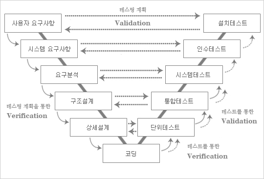

# TIL 240324 정처기 실기
# 22년 3회

### 1번 다음 C언어로 구현도니 프로그램을 분석하여 배열 mines의 각 칸에 들어갈 값을 쓰시오

- 보면 mines 해당되는 인덱스가 점점 쌓이게 되는거임
- 그러면 mine 배열의 인덱스의 값은 field인덱스의 위아래 양옆에 존재하는 1의 갯수랑 같게 됨
### 걍 틀리라고 낸 문제임;;
### 4중 포문 개 쌉쌉 노가다 문제인데, 노가다로 풀 수도 있고
### 사실 지뢰찾기 알고리즘임 
### field값이 1인경우에 그 주위를 +1 해주는거임
### 정답
1 1 3 2
3 4 5 3
3 5 6 4
3 5 5 3

