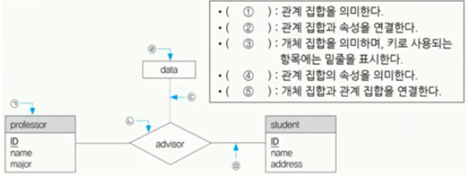

# TIL 240324 정처기 실기
# 22년 3회


### 1번 다음 C언어로 구현도니 프로그램을 분석하여 배열 mines의 각 칸에 들어갈 값을 쓰시오


- 보면 mines 해당되는 인덱스가 점점 쌓이게 되는거임
- 그러면 mine 배열의 인덱스의 값은 field인덱스의 위아래 양옆에 존재하는 1의 갯수랑 같게 됨
### 걍 틀리라고 낸 문제임;;
### 4중 포문 개 쌉쌉 노가다 문제인데, 노가다로 풀 수도 있고
### 사실 지뢰찾기 알고리즘임 
### field값이 1인경우에 그 주위를 +1 해주는거임
### 정답
- 1 1 3 2
- 3 4 5 3
- 3 5 6 4
- 3 5 5 3

### 2번 각 번호에 들어갈 말을 골라서 쓰시오

- 관계 대수는 관계형 데이터베이스에서 원하는 정보와 그 정보를 검색하기 위해서 어떻게 유도하는가를 기술하는 절차적 언어임
- 합집합(UINION)은 두 릴레이션에 존재하는 튜플의 합집합흘 구하되, 결과로 생성된 릴레이션에서 중복되는 튜플은 제거되는 연산으로, 사용하는 기호는 (1)이다
- 차집합(DIFFERENCE)은 두 릴레이션에 존재하는 튜플의 차집합을 구하는 연산으로 사용하는 기호는 (2) 이다
- 교차곱(CARTESIA PRODUCT)는 두 릴레이션에 있는 튜플들의 순서쌍을 구하는 연산으로 사용하는 기호는(3)이다
- 프로젝트(PROJECT)는 주어진 릴레이션에서 속성리스트에 제시된 속성값만을 추출하여 새로운 릴레이션을 만드는 연산으로, 사용하는 기호는 (4)이다
- 조인(JOIN)은 공통 속성을 중심으로 두개의 릴레이션을 하나로 합쳐서 새로운 릴레이션을 만드는 연산으로, 사용하는 기호는(5) 이다

- 각각 해당하는 연산자 기호 쓰기
### 정답


### 3번 빈칸에 보기에서 찾아서 넣기

- (1) 패턴은 구현부에서 추상층을 분리하여, 서로가 독립적으로 확장할 수 있도록 구상한 패턴으로, 기능과 구현을 두개의 별도 클래스로 구현한다는 특징이 있다
- (2) 패턴은 한 객체의 상태가 변화하면 객체에 상속된 다른 객체들에게 변화된 상태를 전달하는 패턴으로, 일대다의 의존성을 정의한다
주로 분산된 시스템간의 이벤트를 생성 발행 하고 이를 수신해야할때 이용한다


### 정답
- 1 브릿지 2 옵저버


### 4번 실행결과는?
```
public class Test{
    public static void main(String[] args){
        int result[] = new int[5];
        int arr[] = {77, 32, 10, 99, 50};
        for(int i = 0; i < 5; i++){
            result[i] = 1;
            for(int j = 0; j < 5; j++){
                if(arr[i] < arr[j]){
                    result[i] ++;
                }
            }
        }
        for(int k = 0; k < 5; k++){ //여기는 출력
            System.out,print(result[k]);
        }
    }
}
```

- 0부터 4 까지 for문을 하면서 서로 비교하는 문제임
- i = 0 일때 j의 0 1 2 3 4 를 비교해서 77보다 큰건 99 한개니까 result[0] = 2
- i = 1 일때 j의 0 1 2 3 4 를 비교해서 32보다 큰건 77, 99, 50 이니까 result[1] = 4
- 이렇게 반복

### 정답
- 2 4 5 1 3


### 5번 192.168.1.0/24 네트워크를 FLSM 방식을 이용하여 3개의 subnet으로 나누었을 때, 두번째 네트워크의 브로드캐스트 IP주소를 10진수로 쓰시오

- /24 는 255.255.255.0 임 192.168.1. 까지는 고정임
- 3개의 서브넷으로 나누려면 2개 비트가 필요함
- 두번째 네트워크는 01이고 IP는 01000000 ~ 01111111 이니까 64~127 
- 브로드캐스트 IP주소는 가장 마지막이니까 192.168.1.127
- https://sssinga.tistory.com/entry/%EC%A0%95%EB%B3%B4%EC%B2%98%EB%A6%AC%EA%B8%B0%EC%82%AC-%EA%B3%84%EC%82%B0%EC%8B%9D-IP%ED%81%B4%EB%9E%98%EC%8A%A4#%EC%9C%A0%ED%98%951._a%EA%B0%9C%EC%9D%98_%EC%84%9C%EB%B8%8C%EB%84%B7%EC%9C%BC%EB%A1%9C_%EB%82%98%EB%88%88_%EB%84%A4%ED%8A%B8%EC%9B%8C%ED%81%AC_%EC%A4%91_b%EB%B2%88%EC%A7%B8_%EB%84%A4%ED%8A%B8%EC%9B%8C%ED%81%AC%EC%9D%98_%ED%8A%B9%EC%A0%95_IP_%EA%B5%AC%ED%95%98%EA%B8%B0 참고
### 정답
- 192.168.1.127


### 6번 다음과 같이 평가 점수표를 미리 정해놓고 각 영역에 해당하는 입력값을 넣고, 예상되는 출력값이 나오는지 실제 값과 비교하는 명세 기반 테스트 기법은?


### 정답
- Boundary Value Analysis


### 7번 다음과 같이 테이블을 정의하고 튜플을 삽입했을때 각 1,2의 SQL문을 실행한 결과를 쓰시오


- 1번은 부서코드 20인 사람들을 직원 테이블에서 골라서 distict count한 결과임
- distict는 겹치는거고(얘는 적용해도 의미없음 count를 한 결과값에서 distict를 하기 떄문에 3하나를 distinct 할 순 없음) count는 수를 세는거니까 20 부서코드 직원은 3명

- 2번은 부서코드 20인 사람들을 부서 테이블에서 골라서 delete하고(직원테이블은 부서테이블을 참조하니까 직원테이블의 20짜리 삭제), 
- 수를 세는건데 이건 직원테이블에서 하라는거임 그럼 10 두명, 30 두명이니까 4가 나옴

### 정답
- 1번 3 2번 2


### 8번 1 2 번에 들어갈 말은?

- (1)은 컴퓨터 보안에 있어서, 인간 상호작용의 깊은 신뢰를 바탕으로 사람들을 속여 보안 절차를 깨트리기 위한 비기술적 시스템 침입 수단을 의미한다
- (2)는 특정 목적을 가지고 데이터를 수집하였으나, 이후 활용되지 않고 저장만 되어있는 대량의 데이터를 의미한다. 미래에 사용될 가능성을 고려하여 저장 공간에서 삭제되지 않고 보관되어 있으나, 이는 저장공관의 낭비뿐만 아니라 보안 위험을 초래할 수도 있다

- 사회공학의 기법중 하나로 스피어 피싱(Spear Phshing)이 있음
- 특정 대상을 선정한 뒤에 일반적인 이메일로 위장한 메일을 지속적으로 발송해서 이걸 누르면 개인정보 탈취됨


### 정답
- 1번 사회공학(Social Engineering) 2번 다크데이터(Dark Data)


### 9번 다음 python 프로그램 실행결과는?
```
a = [1,2,3,4,5]
a = list(map(lambda num : num + 100,a))

print(a)
```

- map은 원래 map(함수, 리스트) 이렇게 생김 map안에 함수를 실행하는데 그 파라미터로 리스트를 돌릴거임
- lambda는 변수명 : 수학식으로 되어있음 이건 수학식을 계산한걸 변수에 넣을거임
- 그러면 num에 a의 각 리스트를 순차적으로 돌면서 a[0]의 값에 100을 더해서 반복해주는거임


### 정답
- [101,102,103,104,105] 대괄호 조심


### 10번 다음 설명하는 용어는?

- 다양한 장비에서 발생하는 로그 및 보안 이벤트를 통합하여 관리하는 보안 솔루션으로, 방화벽, IDS, IPS 웹 방화벽, VPN등에서 발생한 로그 및 보안 이벤트를 통합하여 관리함으로써 비용 및 자원을 절약할 수 있는 특징이 있다. 또한 보안 솔루션 간의 상호 연동을 통해서 종합적인 보안 관리 체계를 수립할 수 있다.


- 얘랑 비슷한걸로 ESM(Enterprise Security Management)이 있음
- ESM은 기능은 같은데 짧은 기간의 로그 및 보안 이벤트를 관리하는 보안 솔루션임


### 정답
- SIEM(Security Information & Event Management)


### 11번 다음 제시된 보기 중 형상관리 도구에 해당하는 것을 3개 고르시오

- OLAP , CVS, ANT, Maven, Git, Jenkins, Spring, SVN


- OLAP : 데이터 웨어하우스, 데이터 마트 또는 기타 중앙화된 통합 데이터 저장소의 대용량 데이터를 고속으로 다차원 분석하는 소프트웨어
- ANT : 아파치 앤트는 자바 프로그래밍 언어에서 사용하는 자동화된 소프트웨어 빌드 도구
- Maven : 아파치 소프트웨어 재단에서 개발하는 Java 기반 프로젝트의 라이프사이클 관리를 위한 빌드 도구
- Jenkins : 젠킨스는 소프트웨어 개발 시 지속적 통합 서비스를 제공하는 툴
- Spring : 스프링 프레임워크 

- CVS(Concurrent Version System) : 서버와 클라이언트로 구분되어, 개발과정에서 사용하는 파일들의 변경 명세를 관리하기 위한 시스템
- SVN(SubVersion) : 중앙집중관리식 형상관리 소스 관리 툴, 각각의 개발자들이 본인의 코드 변경 사항을 하나의 중앙 저장소 (Center Repository) 에 commit 하는 방식


### 정답
- CVS, Git, SVN


### 12번 학생 테이블에 전기과 학생이 50명, 전산과 학생이 100명, 전자과 학생이 50명 있다고 할 떄, 다음 실행결과로 표시되는 튜플의 갯수는? (DEPT 필드는 학과를 의미함)

- 1. SELECT DEPT FROM STUDENT
- 2. SELECT DISTINCT DEPT FROM STUDENT
- 3. SELECT COUNT(DISTINCT DEPT) FROM STUDENT WHERE DEPT = '전산과'


- 1번은 STUDENT 테이블의 DEPT필드를 검색하는거임 -> 전기과 50명, 전산과 100명, 전자과 50명 전부 검색이니까 200
- 2번은 STUDENT 테이블에서 DEPT필드를 검색하는데, 중복되는게 있으면 중복은 제거임 -> 전산한번, 전자한번, 전자한번 이니까 3
- 3번은 STUDENT 테이블에서 DEPT필드의 전산과를 검색하는데, 중복된거 있으면 제거해버리고 몇개인지 출력임 -> 1


### 정답
- 1번 200 2번 3 3번 1


### 13번 다음 C언어의 실행 결과는?
```
#include <stdio.h>

main(){
    int s, el = 0;
    for(int i = 6; i <= 30; i++){
        s = 0;
        for(int j = 1; j <= i/2; j++)
            if(i % j == 0)
                s = s + j; 
    
        if(s == i)
            el++;
    }   
    printf("%d", el);
}
```

- i가 6 일때 
- 두번째 for는 1 2 3까지 반복
- if문 만족하는건 1 2 3전부 만족함 그럼 s는 6
- el ++ 됨 -> 1

- 풀다보면 6 , 28만 만족해서 2임

### 정답
- 2


### 14번 1, 2번에 들어갈 알맞은 말은?

- (1)은 칩 설계회사인 ARM(Advanced Risc Machine)에서 개발한 기술로, 하나의 프로세서 내에 일반 어플리케이션을 처리하는 일반구역(Normal World)과 필요한 어플리케이션을 처리하는 보안구역으로 분할하여 관리하는 하드웨어 기반의 보안 기술이다
- (2)는 네티즌들이 사이트에 접속할 때 주소를 잘못입력하거나 철자를 빠뜨리는 실수를 이용하기 위해 이와 유사한 도메인을 미리 등록하는것으로 URL 하이재킹이라고도 한다. 유명 사이트들의 도메인을 입력할 때 발생할 수 있는 온갖 도메인 이름을 미리 선점해놓고 이용자가 모르는 사이에 광고 사이트로 이동하게 만든다

- 보기
- Pharming, Tvishing, Trustzone, APT, Typosquatting, Hacktivism, Watering Hole, Smurfing, Ransomeware, CSRF

- Pharming : 파밍(Pharming)은 피싱(Phishing)과 조작(Farming)의 합성어로, 악성프로그램에 감염된 PC를 조작하여 정상 사이트에 접속하더라도 가짜 사이트로 접속을 유도하여 금융거래정보를 빼낸 후 금전적인 피해를 입히는 사기 수법
- Tvishing : 스마트 Tv에 악성 소프트웨어를 설치해서 스마트TV 최고 접근권한을 획득하는 행위, 사생활 및 해적방송 송출함
- APT : 지능적이고(Advanced) 지속적인(Persistent) 공격(Threat)을 가하는 해킹의 통칭.
- Hacktivism : 정치·사회적 목적으로 이루기 위해 해킹하거나 목표물인 서버컴퓨터를 무력화하고 이런 기술을 만드는 운동
-  Watering Hole : 워터링 홀(Watering Hole)은 공격자가 조직이 자주 사용하는 웹 사이트를 추측하거나 관찰하여 그 중 하나 이상을 악성 코드로 감염시키는 컴퓨터 공격 전략
- Smurfing : 공격자가 인터넷 제어 메시지 프로토콜(ICMP) 패킷으로 대상 서버를 폭주시키려고 시도하는 분산 서비스 거부(DDoS) 공격
- Ransomeware : 컴퓨터 시스템을 감염시켜 접근을 제한하고 일종의 몸값을 요구하는 악성 소프트웨어의 한 종류
- CSRF : Cross-Site Request Forgery사이트 간 요청 위조의 줄임말. 웹 애플리케이션 취약점 중 하나로 사용자가 자신의 의지와 무관하게 공격자가 의도한 행동을 해서 특정 웹페이지를 보안에 취약하게 한다거나 수정, 삭제 등의 작업을 하게 만드는 공격 방법

### 정답
- 1번 Trustzone, 2번 Typosquatting


### 15번 다음 괄호에 들어갈 말은?
- ( )은 한번의 로그인으로 개인이 가입한 모든 사이트를 이용할 수 있게 해주는 시스템을 말한다. 개인의 경우 사이트에 접속하기 위하여 아이디와 패스워드는 물론 이름 전화번호 등 개인정보를 각 사이트마다 일일이 기록해야 하던 것이 한번의 작업으로 끝나므로 불편함이 해소되며, 기업에서는 회원에 대한 통합관리가 가능해 마케팅을 극대화시킬 수 있다


### 정답 
- SSO Single Sign On 


### 16번 스케쥴링에 대한 다음 설명에서 괄호에 들어갈 알맞은 용어는?

- (1)은 준비상태 큐에서 기다리고 있는 프로세스들 중에서 실행 시간이 가장 짧은 프로세스에게 먼저 CPU를 할당하는 기법이다. 가장 적은 평균 대기 시간을 제공하는 최적 알고리즘이지만, 실행 시간이 긴 프로세스는 실행 시간이 짧은 프로세스에게 할당 순위가 밀려 무한 연기 상태가 발생될 수 있다.
- (2)은 시분할 시스템을 위해 고안된 방식으로, 준비상태 큐에 먼저 들어온 프로세스가 먼저 CPU를 할당받지만 각 프로세스는 시간 할당량 동안만 실행한 후 실행이 완료되지 않으면 다음 프로세스에게 CPU를 넘겨주고 준비상태 큐의 가장 뒤로 배치된다. 할당되는 시간이 작을 경우 문맥 교환 및 오버헤드가 자주 발생되어 요청된 작업을 신속히 처리할 수 없다.
- (3)는 현재 실행중인 프로세스의 남은 시간과 준비상태 큐에 새로 도착한 프로세스의 실행 시간을 비교하여 가장 짧은 실행 시간을 요구하는 프로세스에게 CPU를 할당하는 기법으로, 시분할 시스템에 유용하다. 준비상태 큐에 있는 각 프로세스의 실행 시간을 추적하여 보유하고 있어야 하므로 오버헤드가 증가한다.


### 정답
- 1번 SJF(Shortest Job First) 2번 RR(Round Robin) 3번 SRT(Shoretest Remaing Time)


### 17번 UML에 대한 다음 설명에서 괄호에 들어갈 알맞은 용어는?

- UML은 시스템 분석, 설계, 구현 등 시스템 갭라 과정에서 시스템 개발자왁 ㅗ객 또는 개발자 상호 간의 의사소통이 원활하게 이루어지도록 표준화한 대표적인 객체지향 모델링 언어로, 사물, (1),다이어그램으로 이루어져 있다.
- (1)는 사물과 사물 사이의 연관성을 표현하는 것으로, 연관, 집합, 포함, 일반화 등 다양한 형태의 (1)가 존재한다.
- (2)는 UML에 표현되는 사물의 하나로, 객체가 갖는 속성과 동작을 표현한다. 일반적으로 직사각형으로 표현하며, 직사각형 안에 이름, 속성, 동작을 표기한다.
- (3)와 (2)와는 UML에표현되는 사물의 하나로, (2)나 컴포넌트의 동작을 모아놓은 것이며, 외부적으로 가시화되는 행동을 표현한다. 단독으로 사용되는 경우는 없으며, (3)구현을 위한 (2)또는 컴포넌트와 함께 사용된다.


### 정답
- 1번 관계 2번 클래스 3번 인터페이스


### 18번 다음 E-R다이어그램을 참고하여 각 괄호에 들어갈 알맞은 말들을 기호로 쓰시오



### 정답 
- ㄴ,ㄷ,ㄱ,ㄹ,ㅁ


### 19번 다음 자바 프로그램의 실행결과는?

```
public class Test{
    static int[] mkarr(){
        int[] tmpArr = new int[4];
        for(int i = 0; i < tmpArr.length; i++)
            tmpArr[i] = i;
        return tmpArr;
    }
    public static void main(String[] args){
        int[] arr;
        arr = mkarr();
        for(int i = 0; i < arr.lentgh; i++)
            System.out.print(arr[i]);
    }
}
```


- mkarr 실행하는 문제임
- 그냥 각 tmpArr[] 0 1 2 3에 0 1 2 3이 들어감
- 그거 출력

### 정답
- 0123


### 20번 다음 자바 프로그램의 실행결과는?
```
public class Test{
    public static void main(String[] args){
        int r = 0;
        for(int i = i; i < 999; i++){
            if(i % 3 == 0 && i % 2 == 0)
                r = i;
        }
        System.out.print(r);
    }
}
```

- 1에서 999의 숫자중에서 3으로 나눴을때 나머지가 0이면서 2로 나눴을때 나머지가 0인 가장 큰 수를 구해야함
- 6으로 나눠지는거중에 가장 큰 수임

### 정답
- 996