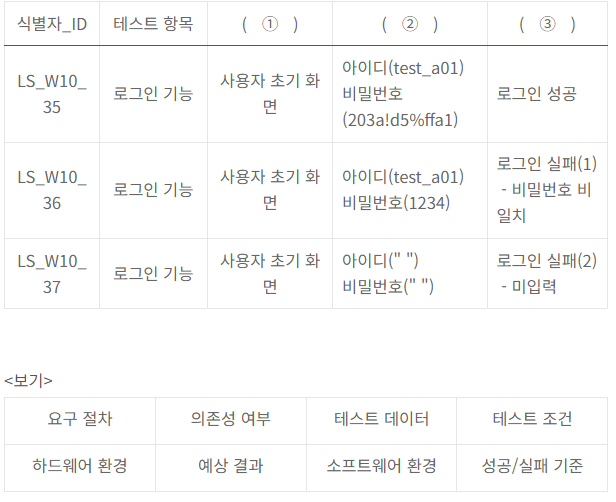
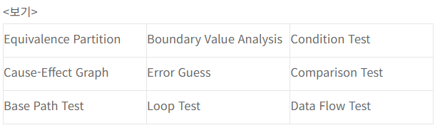

# TIL 240324 정처기 실기
# 21년 3회

### 2번 빈칸에 들어갈 말은?

( )스푸핑은 로컬네트워크에서 사용하는 () 프로토콜의 취약점을 이용한 공격기법으로, 자신의 물리적 주소를 번조하여
다른 PC에게 도달해야 하는데이터 패킷을 가로채거나 방해한다

### 정답
ARP(Address Resolution Rrotocol)

### 3번 데이터를 제어하는 DCL의 하나인 GRANT 기능에 대해 간략히 서술하시오

- COMMIT : 명령에 의해 수행된 결과를 실제 물리적 디스크로 저장하고, 데이터베이스 조작 작업이 정상적으로 완료되었음을 관리자에게 알려주는 것
- ROLLBACK : 데이터베이스 조작 작업이 비정상적으로 종료되었을 때 원래의 상태로 복구함
- GRANT : 데이터베이스 사용자에게 사용권한을 부여함
- REVOKE : 데이터베이스 사용자에게 사용권한을 취소함
### 정답
데이터베이스 관리자가 사용자에게 권한을 부여하는 데 사용하는 명령어임

### 4번 AAA 서버에 관한 다음 설명에서 각 번호에 들어갈 알맞은 말은?

AAA 서버는 사용자의 컴퓨터 자원 접근 처리와 서비스 제공에 있어서의 다음 3가지 기능을 제공하는 서버이다.
1 - 접근하는 사용자의 신원을 검증하는 기능
2 - 신원이 검증된 사용자에게 특정된 권한과 서비스를 허용하는 기능
3 - 사용자가 어떤 종류의 서비스를 이용했고, 얼마만큼의 자원을 사용했는지 기록 및 보관하는 기능

<보기>
Application Authentication Avalache Authorization Accounting Ascii

- Avalache : 동적 소스코드 분석 도구임
### 정답
1 Authentication 2 Authorization 3 Accounting

### 5번 디자인패턴에 관한 다음 설명에서 괄호에 들어갈 알맞은 답을 <보기>에서 찾아쓰시오
() 패턴은 객체 생성을 서브 클래스에서 처리하도록 분리하여 캡슐화한 패턴으로, 상위 클래스에서 인터페이스만 정의하고 실제 생성을 서브 클래스가 담당한다. 다른 이름으로 가상 생성자(Virtual Constructor)패턴이라고도 불린다
<보기>
Singleton / Abstract Factory /  Factory Method / Prototype / Facade / Composite / Template Method / Builder

- Facade :  구조 패턴(Structural Pattern)의 한 종류로써, 복잡한 서브 클래스들의 공통적인 기능을 정의하는 상위 수준의 인터페이스를 제공하는 패턴

### 정답
Factory Method

### 6번 결합도의 종류 중 단순 처리 대상인 데이터만 전달되는 것이 아니라 어떻게 처리해야하는지 결정하는 제어요소가 전달되는 경우의 결합도를 영문으로 쓰시오

- 내용결합도(Content Coupling) : 다른 모듈 내부에 있는 변수나 기능을 다른 모듈에서 사용하는 경우의 결합도
- 공통 결합도(Common Coupling) : 파라미터가 아닌 모듈 밖에 선언되어 있는 전역 변수를 참조하고 전역 변수를 갱신하는 식으로 상호작용하는 경우의 결합도
- 외부 결합도(External Coupling) : 모듈이 다수의 관련 기능을 가질 때 모듈 안의 구성요소들이 그 기능을 순차적으로 수행할 경우의 결합도
- 제어 결합도(Control Coupling) : 어떤 모듈이 다른 모듈의 내부 논리 조직을 제어하기 위한 목적으로 제어 신호를 이용하여 통신하는 경우의 결합도
- 스탬프 결합도(Stamp Coupling) : 모듈 간의 인터페이스로 배열이나 객체, 구조 등이 전달되는 경우의 결합도
- 자료 결합도(Data Coupling) : 모듈 간의 인터페이스로 전달되는 파라미터를 통해서만 모듈 간의 상호 작용이 일어나는 경우의 결합도
### 정답
Control, Control Coupling (둘중 하나)

### 8번 애플리케이션 테스트에 관한 설명 중 괄호에 들어갈 알맞은 답은?
(1)은 소프트웨어의 하위 모듈에서 상위 모듈 방향으로 통합하면서 테스트하는 기법이다
하나의 주요 제어 모듈과 관련된 종속 모듈의 그룹인 클러스터가 필요하다
데이터의 입출력을 확인하기 위해 더미 모듈은 (2)를 생성한다

### 정답
1 상향식 통합 테스트 2 드라이버, 테스트 드라이버

### 10번 <A>테이블과 <B>테이블을 참고하여 <SQL>의 실행 결과는?

<A>          <B>
NAME         RULE
Smith         S%
Allen         %T%
Scott

<SQL문>
SELECT COUNT(*) CNT FROM A CROSS JOIN B WHERE A.NAME LIKE B.RULE;

- SELECT COUNT(*) CNT 는 튜플의 개수를 세는데, 필드명을 CNT로 표시
- FROM A CROSS JOIN B 는 A 와 B를 CROSS JOIN한 결과를 대상으로 검색하는데,
- WHERE A.NAME LIKE B.RULE 는 A테이블의 NAME 필드값이 B테이블의 RULE 필드 조건이랑 일치하는걸 표시해라
- 크로스조인은 한쪽 테이블의 모든 행과 다른 쪽 테이블의 모든 행을 조인하는거임
- A.NAME LIKE S% 이면, A.NAME이 'S'로 시작하는 레코드임
- A.NAME LIKE %T% 이면 A.NAME이 'T'를 포함하는 레코드임
그러면 SMith, Scott 이 두개 겹치니까

### 정답
4

### 11번 괄호에 들어갈 말은?

파일의 구조는 파일을 구성하는 레코드들이 보조기억장치에 편성되는 방식을 의미하는 것으로, 크게 순차,( ), 해싱으로 구분한다. ( )파일 구조는 <값, 주소> 쌍으로 구성되는 데이터구조를 활용하여 데이터에 접근한느 방식으로, 자기 디스크에서 주로 활용된다

### 정답
색인, Index

### 12번 다음 괄호에 들어갈 말은?

### 정답
1 테스트 조건 2 테스트 데이터 3 예상결과

### 13번 UML에 설명에서 괄호에 들어갈 말은?

( )다이어그램은 UML다이어그램 중 객체(Object)들을 ( )로 추상화하여 표현하는 다이어그램으로 대표적인 구조적 다이어그램이다. ( )는 각각의 객체들이 갖는 속성과 메소드를 표현한 것으로 3개의 구획으로 나눠 이름, 속성,메소드를 표기한다

### 정답
클래스

### 14번 OSI7 Layer에 대한 설명중 괄호에 들어갈 말은?

OSI7 Layer는 다른 시스템 간의 원활한 통신을 위해 ISO에서 제안한 통신규약이다
1 - 물리적으로 연결된 두 개의 인접한 개방 시스템들 간에 신뢰성있고 효율적인 정보 전송을 할 수 있도록 연결 설정, 데이터 전송, 오류 제어 등의 기능을 수행한다
2 - 개방 시스템들 간의 네트워크 연결을 관리하며, 경로제어, 패킷 교환, 트래픽 제어 등의 기능을 수행한다
3 - 서로 다른 데이터 표현 형태를 갖는시스템 간의 상호 접속을 위해 필요한 계층으로, 코드 변환, 데이터 암호화, 데이터 압축, 구문 검색 등의 기능을 수행한다 

### 정답
1 데이터 링크 계층 2 네트워크 계층 3 표현 계층

### 15번 1974년 IBM이 개발하고 1975년 NBS에 의해 미국의 국가 표준으로 발표된 암호화 알고리즘으로, 블록 크기는 64비트, 키 길이는 56비트이며, 16회의 라운드를 수행한다. 컴퓨터 기술이 발달함에 따라 해독이 쉬워지면서 미국의 국가 표준이 2001년 AES로 대체되었다

### 정답
DES(Data Encryption Standard)

### 18번 테스트 기법 중 그래프를 활용하여 입력 데이터 간의 관계와 출력에 영향을 미치는 상황을 체계적으로 분석한 다음 효용성이 높은 테스트 케이스를 선정하여 검사하는 기법을 <보기>에서 찾아 쓰시오

### 정답
Cause-Effect Graph

### 19번 Windows,MacOS등에서 사용하는 인터페이스로, 사용자가 명령어를 직접 입력하지 않고, 키보드와 마우스 등을 이용하여 아이콘이나 메뉴를 선택하여 모든 작업을 수행하는 사용자 인터페이스는?

### 정답
GUI

### 20번 UML의 관게에 대한 설명에서 각 번호에 들어갈 말은?

관계는 사물과 사물 사이의 연관성을 표현하는 것이다
1 - 하나의 사물이 다른 사물에 포함되어있는 관계로, 전체와 부분으로 구분되어지며 서로 독립적이다
2 - 상위 모듈이 하위 모듈모다 더 일반적인 개념을 가지고 있으며, 하위 모듈이 상위 모듈보다 더 구체적인 개념을 가진다

<보기>
Association / Aggregation / Composition / Generalization / Dependency / Realizaion

### 정답
1 Aggregation 2 Generalization