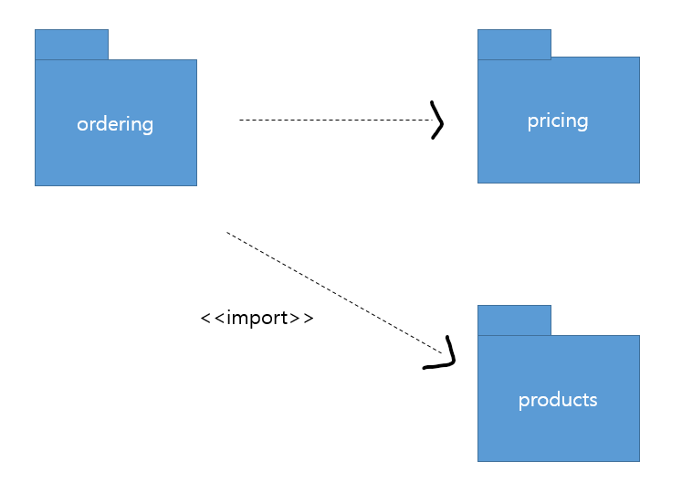
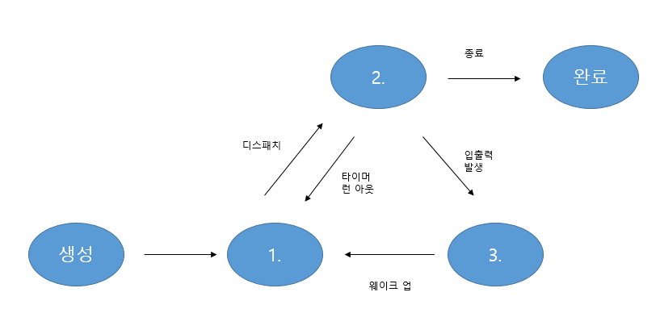
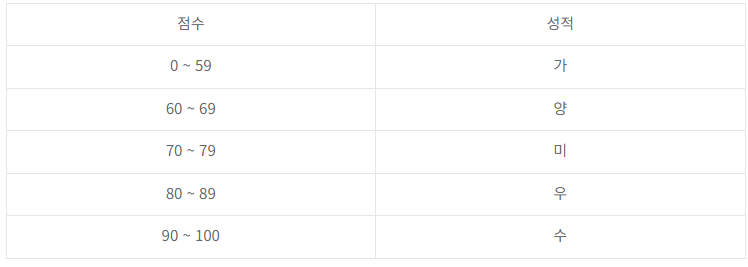
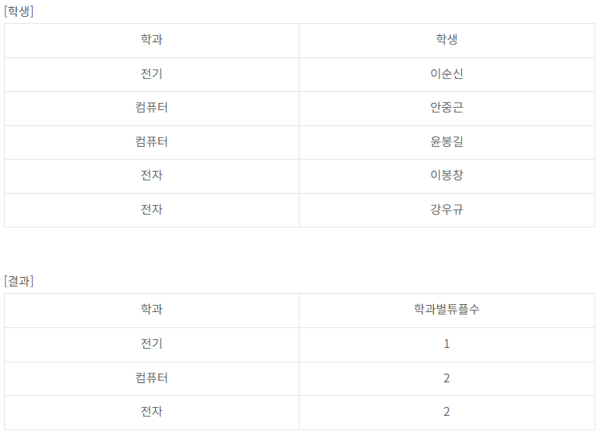

# TIL 240324 정처기 실기
# 21년 3회

### 1번 현재 IPv4의 확장형으로 IPv4가 가지고 있는 주소 고갈, 보안성, 이동성 지원 등의 문제점을 해결하기 위해서 개발된 128비트 주소체계를 갖는 차세대 인터넷 프로토콜은 무엇인가?

### 정답
- IPv6

### 2번 목적에 따른 디자인 패턴의 유형에는 생성, 구조, (  ) 이/가 있다. 괄호 (   ) 안에 알맞는 유형을 쓰시오.

### 정답
- 행위

### 3번 판매와관련된 해당 다이어그램 명칭은? 

### 정답
- 패키지 다이어그램

### 4번 데이터베이스의 회복(Recovery) 기법 중 Rollback 시 Redo, Undo가 모두 실행되는 트랜잭션 처리법으로 트랜잭션 수행 중 갱신 결과를 바로 DB에 반영하는 기법은 무엇인가?

회복 기법 종류 : 
로그 기반 회복 기법 - 지연 갱신 회복 기법 / 즉각 갱신 회복 기법
체크 포인트 회복 기법
그림자 페이징 회복 기법
미디어 회복 기법
 
지연 갱신 회복 기법 : 
트랜잭션의 부분 완료 상태에선 변경 내용을 로그 파일에만 저장
 
체크 포인트 회복 기법 : 
장애 발생 시, 검사점(checkpoint) 이전에 처리된 트랜잭션은 회복에서 제외하고 검사점 이후에 처리된 트랜잭션은 회복 작업 수행
 
그림자 페이징 회복 기법 : 
트랜잭션이 실행되는 메모리상의 current page table과 하드디스크의 shadow page table이용
 
미디어 회복 기법 : 
디스크와 같은 비휘발성 저장 장치가 손상되는 장애 발생을 대비한 회복 기법
### 정답
- 즉각 갱신 회복 기법

### 7번 스니핑에 대해서 설명해라

IP스푸핑 : 발신지 IP나 목적지 IP를 위조하여 공격하는 기법
ARP스푸핑 : MAC 주소를 위조하여 랜상에서의 통신 흐름을 왜곡시키는 공격 기법
트로이 목마 : 사용자가 원하는 무언가로 변장해 시스템 방어망을 뚫고 들어가는 공격 기법
### 정답
- 암호화되지 않은 패킷들을 수집하여 순서대로 재조합 후 ID, PW와 같은 중요한 정보를 유출하기 위한 수동적인 형태의 공격

### 8번 IP 패킷에서 외부의 공인 IP주소와 포트 주소에 해당하는 내부 IP주소를 재기록하여 라우터를 통해 네트워크 트래픽을 주고받는 기술은 무엇인가?

### 정답
- NAT(Network Address Transformation)

### 10번 분산 컴퓨팅 기술 기반의 데이터 위변조 방지 기술로 P2P방식을 기반으로 하여 소규모 데이터들이 연결되어 형성된 '블록'이라는 분산 데이터 저장 환경에 관리 대상 데이터를 저장함으로써 누구도 임의로 수정할 수 없고 누구나 변경의 결과를 열람할 수 있게끔 만드는 기술은 무엇인가?

### 정답
- 블록체인

### 11번 오픈 소스 기반으로 한 분산 컴퓨팅 플랫폼으로, 일반 PC급 컴퓨터들로 가상화된 대형 스토리지를 형성하고 그 안에 보관된 거대한 데이터 세트를 병렬로 처리할 수 있도록 개발된 자바 소프트웨어 프레임워크로 구글, 야후 등에 적용한 기술은 무엇인가? 

### 정답
- 하둡

### 12번 이상현상의 종류 3가지는?

## 정답
- 삽입 이상, 삭제 이상,  갱신 이상

### 13번 다음 프로세스상태 전이도에서 1,2,3에 들어갈 말은?

### 정답
- 1.준비   2.실행   3.대기

### 14번 테스트 오라클 중 특정한 몇 개의 입력값에 대해서만 기대하는 결과를 제공해주는 오라클은 무엇인가?

테스트 오라클 유형 : 
참 오라클 - 모든 입력값에 대하여 기대하는 결과를 생성하여 오류 검출
샘플링 오라클 - 특정한 몇 개의 입력값에 대해서만 기대하는 결과를 제공
휴리스틱 오라클 - 샘플링 오라클을 개선 / 특정 입력값에 올바른 결과를 제공하고 나머지 값은 휴리스틱(추정)으로 처리
일관성 검사 오라클 - 애플리케이션 변경이 있을 때, 수행 전과 후의 결괏값이 동일한지 확인
### 정답 
- 샘플링 오라클

### 15번 점수에 따른 성적 부여가 잘 되었는지 테스트하고자 한다. 아래에 알맞는 테스트 기법은 무엇인가?

[테스트 값] : -10점 / 30점 / 65점 / 75점 / 85점 / 95점 / 110점

동등분할 테스트는 입력 데이터의 영역을 유사한 도메인별로 유효 값 / 무효 값을 그룹핑하여 대푯값 테스트 케이스를 도출하여 테스트하는 기법임

### 정답
- 동등분할 테스트

### 16번 다음 조건을 만족하면서 학과별로 튜플 수가 얼마인지 구하는 SQL문을 작성하시오.
- 대소문자를 구분하지 않는다.
- WHERE 구문을 사용하지 않는다.
- GROUP BY 를 사용한다.
- 세미콜론(;)은 생략 가능하다.
- 별칭(AS)을 사용해야 한다. (별칭 사용 시 별칭은 작은 따옴표를 써야 함)
- 집계 함수를 사용해야 한다.

### 정답
- SELECT 학과, COUNT(학과) AS 학과별튜플수 FROM 학생 GROUP BY 학과;

### 17번  데니스 리치와 켄톰슨 등이 함께 벨 연구소를 통해 만든 운영체제이며, 90% 이상 C언어로 구현되어 있고, 시스템 프로그램이 모듈화되어 있어서 다른 하드웨어 기종으로 쉽게 이식 가능하며 계층적 트리 구조를 가짐으로써 통합적인 파일 관리가 용이한 운영체제는 무엇인가?

### 정답
- 유닉스

### 20번 정보보안에서 가용성에 대해서 설명하시오

- 기밀성 / 무결성 / 가용성 기무가를 기억해
### 정답
- 권한을 가진 사용자가 애플리케이션이 원하는 서비스를 지속 사용할 수 있도록 보장하는 특성
